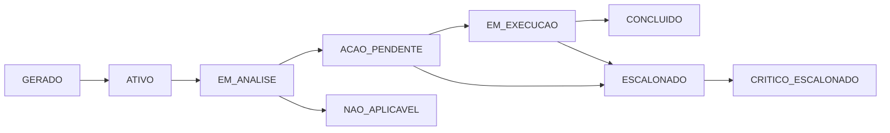

# 🏗️ ARQUITETURA DO SISTEMA DE CICLO DE VIDA INTELIGENTE DE ALERTAS CONTRATUAIS

**Projeto:** SAAB-Tech - Sistema de Acompanhamento e Análise Baseada em Tecnologia  
**Instituição:** Tribunal de Justiça de São Paulo  
**Data:** Janeiro de 2026  
**Versão:** 1.0

---

## 📋 SUMÁRIO EXECUTIVO

Este documento apresenta a arquitetura conceitual e técnica de um **Sistema de Ciclo de Vida Inteligente de Alertas Contratuais**, projetado para transformar o modelo atual de alertas estáticos em um sistema dinâmico, auditável e orientado à ação.

### Objetivo Estratégico

Substituir controles paralelos (planilhas) por um sistema institucional que:
- Estrutura decisões administrativas
- Gera encadeamento automático de ações
- Produz memória institucional auditável
- Apoia governança estratégica
- Preserva autonomia decisória humana

### Mudança de Paradigma

**MODELO ATUAL:**  
`Alerta → Visualização → Justificativa → Fim`

**MODELO PROPOSTO:**  
`Alerta → Ação Obrigatória → Novo Prazo → Novo Alerta → Histórico Estruturado → BI Prospectivo`

---

## 📊 PARTE 1: DIAGNÓSTICO DO SISTEMA ATUAL

### Análise da Arquitetura Existente

Após análise dos arquivos:
- [alert_service.py](../services/alert_service.py)
- [ff_alert_rules.py](../services/ff_alert_rules.py)
- [07_🔔_Alertas.py](../pages/07_🔔_Alertas.py)
- [history_service.py](../services/history_service.py)

#### ✅ Pontos Fortes Identificados

1. **Separação de Responsabilidades Clara**
   - Sistema APONTA (função calculadora)
   - Gestor DECIDE (interface de resolução)
   - Sistema REGISTRA (histórico)

2. **Regras Parametrizáveis**
   - Configuração centralizada (`DIAS_ALERTA_ATESTE_PENDENTE`, etc.)
   - Múltiplas categorias de alerta (Vigência, FF, Status)
   - Três níveis de criticidade (crítico, atenção, info)

3. **Infraestrutura de Auditoria**
   - `history_service.py` com SQLite
   - Registro de eventos com metadados
   - Rastreabilidade de ações

4. **Integração com Workflow Existente**
   - Conexão com notificações
   - Navegação para detalhes do contrato
   - Justificativa obrigatória para resolução

#### ⚠️ Limitações Críticas Identificadas

1. **Ausência de Estados Intermediários**
   ```python
   # Atual: apenas 3 estados
   STATUS_ATIVO = "ATIVO"
   STATUS_RESOLVIDO = "RESOLVIDO"
   STATUS_ARQUIVADO = "ARQUIVADO"
   ```
   **Problema:** Não há como representar "em análise", "aguardando providência", "escalonado", etc.

2. **Falta de Encadeamento**
   - Alerta resolvido não gera novo alerta automaticamente
   - Não há relação entre alerta-origem e alerta-derivado
   - Prazos não são calculados prospectivamente

3. **Dados Não Estruturados**
   ```python
   # Justificativa como texto livre
   justificativa: str
   ```
   **Problema:** IA não consegue categorizar decisões nem aprender com histórico

4. **Ausência de Janela de Segurança**
   - Sistema não calcula "tempo real restante"
   - Não alerta sobre consumo silencioso do prazo
   - Gestor pode adiar indefinidamente sem controle

5. **BI Reativo, Não Prospectivo**
   - Dashboards mostram "estado atual"
   - Não preveem rupturas futuras
   - Não identificam gargalos antes que ocorram

---

## 🎯 PARTE 2: MODELO CONCEITUAL DE ALERTAS

### 2.1 Nova Taxonomia de Alertas

#### Tipos de Alertas por Natureza

```
┌─────────────────────────────────────────────────────────────┐
│ TIPO              │ DEFINIÇÃO                │ EXEMPLO       │
├─────────────────────────────────────────────────────────────┤
│ PREVENTIVO        │ Antecipa risco futuro    │ Vigência 180d │
│ OPERACIONAL       │ Ação pendente no fluxo   │ Ateste NF     │
│ CRÍTICO           │ Risco de ruptura iminente│ Vigência 30d  │
│ ESCALONADO        │ Prazo vencido sem ação   │ Alerta +30d   │
│ INFORMATIVO       │ Contexto para decisão    │ Histórico     │
└─────────────────────────────────────────────────────────────┘
```

#### Estados do Ciclo de Vida do Alerta



**Definição dos Estados:**

| Estado | Descrição | Quem Atua | Prazo |
|--------|-----------|-----------|-------|
| `GERADO` | Sistema detectou condição | Sistema | Instantâneo |
| `ATIVO` | Aguardando análise do gestor | Gestor | Depende do tipo |
| `EM_ANALISE` | Gestor iniciou análise | Gestor | 2-5 dias úteis |
| `ACAO_PENDENTE` | Decisão tomada, ação definida | Executor | Conforme decisão |
| `EM_EXECUCAO` | Providências em andamento | Executor | Conforme prazo |
| `CONCLUIDO` | Alerta resolvido definitivamente | - | - |
| `ESCALONADO` | Prazo vencido sem ação | Sistema | Automático |
| `NAO_APLICAVEL` | Condição não se aplica (justificado) | Gestor | - |

### 2.2 Matriz de Criticidade e Prazos

```
┌────────────────────────────────────────────────────────────────────┐
│ CATEGORIA     │ CONDIÇÃO           │ TIPO      │ PRAZO RESPOSTA   │
├────────────────────────────────────────────────────────────────────┤
│ Vigência      │ > 180 dias         │ PREVENTIVO│ 30 dias          │
│ Vigência      │ 90-180 dias        │ PREVENTIVO│ 15 dias          │
│ Vigência      │ 60-90 dias         │ OPERACIONAL│ 7 dias          │
│ Vigência      │ 30-60 dias         │ CRÍTICO   │ 3 dias           │
│ Vigência      │ < 30 dias          │ CRÍTICO   │ 1 dia            │
│ Vigência      │ Vencido            │ ESCALONADO│ Imediato         │
├────────────────────────────────────────────────────────────────────┤
│ FF - Ateste   │ NF emitida         │ OPERACIONAL│ 5 dias úteis    │
│ FF - Ateste   │ > 5 dias           │ CRÍTICO   │ 2 dias           │
│ FF - Ateste   │ > 10 dias          │ ESCALONADO│ Imediato         │
├────────────────────────────────────────────────────────────────────┤
│ FF - Pagamento│ Atestado           │ OPERACIONAL│ 15 dias         │
│ FF - Pagamento│ > 30 dias ateste   │ CRÍTICO   │ 3 dias           │
│ FF - Pagamento│ > 45 dias ateste   │ ESCALONADO│ Imediato         │
└────────────────────────────────────────────────────────────────────┘
```

### 2.3 Encadeamento de Alertas (Regras de Transição)

#### Exemplo: Ciclo Completo de Vigência

```
┌─────────────────────────────────────────────────────────────────┐
│ TEMPO      │ ALERTA                    │ AÇÃO REQUERIDA        │
├─────────────────────────────────────────────────────────────────┤
│ T-180d     │ VIG_PREV_001              │ Avaliar renovação     │
│            │ ↓ Gestor decide: RENOVAR  │                       │
│ T-150d     │ VIG_OPER_002 (derivado)   │ Iniciar processo      │
│            │ ↓ Protocolo aberto        │                       │
│ T-90d      │ VIG_OPER_003 (derivado)   │ Verificar andamento   │
│            │ ↓ Parecer técnico pronto  │                       │
│ T-60d      │ VIG_CRIT_004 (derivado)   │ Conclusão urgente     │
│            │ ↓ Prorrogação publicada   │                       │
│ T-atual    │ VIG_OPER_005 (derivado)   │ Apostilar contrato    │
│            │ CICLO ENCERRADO           │                       │
└─────────────────────────────────────────────────────────────────┘
```

**Cada transição:**
- Registra decisão do gestor
- Calcula novo prazo automaticamente
- Gera alerta derivado se necessário
- Atualiza janela de segurança
- Alimenta BI com previsões

---

## �️ PARTE 3: MODELO DE DADOS DETALHADO

### 3.1 Visão Geral da Arquitetura de Dados

```
┌─────────────────────────────────────────────────────────────────┐
│                    MODELO DE DADOS COMPLETO                     │
├─────────────────────────────────────────────────────────────────┤
│                                                                 │
│  ┌──────────────┐         ┌──────────────┐                     │
│  │   CONTRATO   │────1:N──│    ALERTA    │                     │
│  └──────────────┘         └──────┬───────┘                     │
│                                  │                              │
│                           ┌──────┴───────┐                      │
│                           │              │                      │
│                    ┌──────▼──────┐  ┌───▼────────────┐         │
│                    │ ACAO_ALERTA │  │ ALERTA_DERIVADO│         │
│                    └──────┬──────┘  └────────────────┘         │
│                           │                                     │
│                    ┌──────▼──────────┐                          │
│                    │ HISTORICO_ALERTA│                          │
│                    └─────────────────┘                          │
│                                                                 │
└─────────────────────────────────────────────────────────────────┘
```

### 3.2 Entidade: ALERTA

**Evolução do Modelo Atual:**

```python
# MODELO ATUAL (simplificado)
alerta_v1 = {
    'id': str,
    'tipo': str,  # critico, atencao, info
    'categoria': str,
    'titulo': str,
    'descricao': str,
    'contrato_id': str,
    'status': str,  # ATIVO, RESOLVIDO, ARQUIVADO
    'data_alerta': datetime
}

# MODELO PROPOSTO (ciclo de vida)
alerta_v2 = {
    # Identificação
    'id': str,  # UUID
    'contrato_id': str,
    'alerta_origem_id': str | None,  # 🆕 Encadeamento
    'geracao': int,  # 🆕 1, 2, 3... (derivações)
    
    # Classificação
    'tipo': str,  # PREVENTIVO, OPERACIONAL, CRITICO, ESCALONADO, INFORMATIVO
    'categoria': str,  # Vigência, FF, Garantia, etc.
    'subcategoria': str | None,  # 🆕 FF_Ateste, FF_Pagamento
    'criticidade': int,  # 🆕 1-10 (calculada)
    
    # Conteúdo
    'titulo': str,
    'descricao': str,
    'contexto_ia': str,  # 🆕 Análise contextual IA
    
    # Ciclo de Vida
    'estado': str,  # 🆕 GERADO, ATIVO, EM_ANALISE, etc.
    'estado_anterior': str | None,  # 🆕 Rastreamento
    'data_geracao': datetime,
    'data_ativacao': datetime | None,
    'data_limite_resposta': datetime,  # 🆕 SLA
    'data_conclusao': datetime | None,
    
    # Gestão de Prazo
    'prazo_original_dias': int,  # 🆕 Ex: 180 dias
    'prazo_consumido_dias': int,  # 🆕 Dias já gastos
    'prazo_restante_dias': int,  # 🆕 Calculado
    'janela_seguranca_dias': int,  # 🆕 Tempo mínimo necessário
    'risco_ruptura': bool,  # 🆕 prazo_restante < janela_seguranca
    
    # Responsabilidade
    'responsavel_atual': str,  # 🆕 Matrícula/email
    'unidade_responsavel': str,  # 🆕 Setor
    'escalonamento_nivel': int,  # 🆕 0, 1, 2 (hierarquia)
    
    # Ação Requerida
    'acao_sugerida': str,
    'acoes_possiveis': list[str],  # 🆕 Catálogo de ações
    'acao_obrigatoria': bool,  # 🆕 Não pode ser "não aplicável"
    
    # Metadados
    'regra_origem': str,  # 🆕 Qual regra gerou o alerta
    'metadados': dict,  # Dados específicos do tipo
    'tags': list[str],  # 🆕 Classificação livre
    
    # Auditoria
    'created_at': datetime,
    'updated_at': datetime,
    'created_by': str,  # 'SISTEMA' ou usuário
    'versao': int  # 🆕 Versionamento do registro
}
```

**Exemplo JSON Completo:**

```json
{
  "id": "ALT-2026-00123",
  "contrato_id": "CONT-2024-0456",
  "alerta_origem_id": "ALT-2025-00987",
  "geracao": 2,
  
  "tipo": "OPERACIONAL",
  "categoria": "Vigência",
  "subcategoria": "Processo_Renovacao",
  "criticidade": 7,
  
  "titulo": "Processo de prorrogação deve ser iniciado",
  "descricao": "Com base na decisão de renovar o contrato (decisão ALT-2025-00987), o processo administrativo deve ser protocolado nos próximos 15 dias para garantir tempo hábil de tramitação.",
  "contexto_ia": "Histórico institucional indica tempo médio de 120 dias para conclusão de processos de prorrogação nesta modalidade. Considerando vigência em T-150d, o processo deve iniciar agora.",
  
  "estado": "ACAO_PENDENTE",
  "estado_anterior": "EM_ANALISE",
  "data_geracao": "2026-01-08T10:30:00",
  "data_ativacao": "2026-01-08T10:30:00",
  "data_limite_resposta": "2026-01-23T23:59:59",
  "data_conclusao": null,
  
  "prazo_original_dias": 180,
  "prazo_consumido_dias": 30,
  "prazo_restante_dias": 150,
  "janela_seguranca_dias": 120,
  "risco_ruptura": false,
  
  "responsavel_atual": "gestor.contratos@tjsp.jus.br",
  "unidade_responsavel": "SAAB - Seção de Contratos",
  "escalonamento_nivel": 0,
  
  "acao_sugerida": "protocolar_processo_prorrogacao",
  "acoes_possiveis": [
    "protocolar_processo_prorrogacao",
    "solicitar_documentacao",
    "agendar_reuniao_tecnica"
  ],
  "acao_obrigatoria": true,
  
  "regra_origem": "REGRA_VIG_ENCADEAMENTO_POS_DECISAO",
  "metadados": {
    "tipo_contrato": "Fornecimento Contínuo",
    "modalidade_licitacao": "Pregão Eletrônico",
    "valor_anual": 2400000.00,
    "fornecedor": "Empresa XYZ Ltda",
    "decisao_origem": {
      "tipo": "RENOVAR",
      "justificativa": "Serviço essencial com desempenho satisfatório",
      "data": "2025-12-15"
    }
  },
  "tags": ["renovacao", "essencial", "alto_valor"],
  
  "created_at": "2026-01-08T10:30:00",
  "updated_at": "2026-01-08T10:30:00",
  "created_by": "SISTEMA",
  "versao": 1
}
```

### 3.3 Entidade: ACAO_ALERTA

**Propósito:** Registrar decisões e providências tomadas pelo gestor.

```python
acao_alerta = {
    # Identificação
    'id': str,  # UUID
    'alerta_id': str,
    'sequencia': int,  # 1, 2, 3... (várias ações por alerta)
    
    # Classificação da Ação
    'tipo_acao': str,  # Catálogo estruturado (ver abaixo)
    'categoria_decisao': str,  # PROVIDENCIA, NAO_APLICAVEL, ESCALONAMENTO
    
    # Conteúdo
    'decisao': str,  # Texto estruturado
    'justificativa': str,  # Texto livre do gestor
    'justificativa_classificada': dict,  # 🆕 IA classifica
    
    # Consequências
    'gera_novo_alerta': bool,
    'novo_alerta_id': str | None,
    'novo_prazo_dias': int | None,
    'altera_responsavel': bool,
    'novo_responsavel': str | None,
    
    # Execução
    'prazo_execucao_dias': int | None,
    'data_limite_execucao': datetime | None,
    'status_execucao': str,  # PENDENTE, EM_ANDAMENTO, CONCLUIDA, ATRASADA
    
    # Evidências
    'documentos_anexos': list[str],  # URLs/IDs
    'numero_processo': str | None,
    'numero_sei': str | None,
    
    # Análise de Risco (IA)
    'risco_calculado': dict,  # 🆕 Ver estrutura abaixo
    
    # Auditoria
    'responsavel': str,
    'unidade': str,
    'data_decisao': datetime,
    'data_execucao': datetime | None,
    'ip_origem': str,
    'created_at': datetime
}
```

**Catálogo de Tipos de Ação (Estruturado):**

```json
{
  "VIGENCIA": {
    "RENOVAR": {
      "descricao": "Prorrogar vigência do contrato",
      "gera_alerta": true,
      "novo_prazo_base": 15,
      "documentos_obrigatorios": ["justificativa_tecnica", "pesquisa_precos"]
    },
    "NAO_RENOVAR": {
      "descricao": "Não prorrogar - iniciar nova licitação",
      "gera_alerta": true,
      "novo_prazo_base": 30,
      "documentos_obrigatorios": ["termo_referencia"]
    },
    "EMERGENCIAL": {
      "descricao": "Contratação emergencial",
      "gera_alerta": true,
      "novo_prazo_base": 7,
      "escalonamento_automatico": true
    }
  },
  "EXECUCAO_FF": {
    "ATESTAR_NF": {
      "descricao": "Atestar nota fiscal",
      "gera_alerta": true,
      "novo_prazo_base": 15
    },
    "GLOSAR_NF": {
      "descricao": "Glosar parcial/total",
      "gera_alerta": true,
      "novo_prazo_base": 5
    },
    "SOLICITAR_CORRECAO": {
      "descricao": "Solicitar correção de NF",
      "gera_alerta": true,
      "novo_prazo_base": 10
    }
  },
  "GERAL": {
    "NAO_APLICAVEL": {
      "descricao": "Alerta não se aplica",
      "gera_alerta": false,
      "justificativa_obrigatoria": true,
      "exige_aprovacao_superior": true
    },
    "ESCALONAR": {
      "descricao": "Escalonar para superior",
      "gera_alerta": true,
      "novo_prazo_base": 3,
      "altera_responsavel": true
    }
  }
}
```

**Exemplo JSON - Ação com Análise de Risco IA:**

```json
{
  "id": "ACAO-2026-00045",
  "alerta_id": "ALT-2026-00123",
  "sequencia": 1,
  
  "tipo_acao": "RENOVAR",
  "categoria_decisao": "PROVIDENCIA",
  
  "decisao": "Iniciar processo de prorrogação contratual por mais 12 meses",
  "justificativa": "O serviço prestado pela empresa XYZ tem sido satisfatório, com cumprimento regular das obrigações. Considerando a essencialidade do serviço e a ausência de registro de penalidades, entendo conveniente a prorrogação nos termos do art. 57, II da Lei 8.666/93.",
  
  "justificativa_classificada": {
    "ia_analise": {
      "categoria_principal": "desempenho_satisfatorio",
      "fundamentacao_legal": ["Lei 8.666/93 art. 57, II"],
      "criterios_identificados": [
        "cumprimento_obrigacoes",
        "ausencia_penalidades",
        "essencialidade_servico"
      ],
      "completude": 0.85,
      "clareza": 0.90
    }
  },
  
  "gera_novo_alerta": true,
  "novo_alerta_id": "ALT-2026-00124",
  "novo_prazo_dias": 15,
  "altera_responsavel": false,
  "novo_responsavel": null,
  
  "prazo_execucao_dias": 15,
  "data_limite_execucao": "2026-01-23T23:59:59",
  "status_execucao": "PENDENTE",
  
  "documentos_anexos": [],
  "numero_processo": null,
  "numero_sei": null,
  
  "risco_calculado": {
    "nivel_risco": "BAIXO",
    "score": 0.25,
    "fatores": {
      "prazo_disponivel": {
        "valor": 150,
        "adequado": true,
        "peso": 0.3
      },
      "historico_gestor": {
        "taxa_cumprimento_prazo": 0.92,
        "media_dias_execucao": 8.5,
        "peso": 0.2
      },
      "complexidade_acao": {
        "tipo": "ROTINEIRA",
        "documentos_pendentes": 0,
        "peso": 0.3
      },
      "janela_seguranca": {
        "dias_restantes": 150,
        "dias_necessarios": 120,
        "margem": 30,
        "peso": 0.2
      }
    },
    "recomendacao_ia": "Prazo adequado. Histórico do gestor indica cumprimento provável. Sugestão: protocolar processo em até 7 dias para manter margem confortável."
  },
  
  "responsavel": "gestor.contratos@tjsp.jus.br",
  "unidade": "SAAB",
  "data_decisao": "2026-01-08T14:30:00",
  "data_execucao": null,
  "ip_origem": "10.1.2.34",
  "created_at": "2026-01-08T14:30:00"
}
```

### 3.4 Entidade: HISTORICO_ALERTA

**Propósito:** Trilha de auditoria completa com snapshots de estado.

```python
historico_alerta = {
    'id': str,
    'alerta_id': str,
    'timestamp': datetime,
    
    # Snapshot do Estado
    'estado_anterior': str,
    'estado_novo': str,
    'evento': str,  # CRIADO, ATIVADO, ANALISADO, ACAO_REGISTRADA, etc.
    
    # Dados do Evento
    'acao_id': str | None,
    'responsavel': str,
    'descricao': str,
    
    # Contexto no Momento
    'prazo_restante_dias': int,
    'criticidade_momento': int,
    'risco_ruptura_momento': bool,
    
    # Snapshot Completo (JSON)
    'alerta_snapshot': dict,  # Estado completo do alerta
    
    # Auditoria
    'ip_origem': str,
    'user_agent': str | None,
    'created_at': datetime
}
```

### 3.5 Entidade: REGRA_TRANSICAO

**Propósito:** Motor de regras configurável (não hardcoded).

```python
regra_transicao = {
    'id': str,
    'nome': str,
    'descricao': str,
    'ativa': bool,
    
    # Condições de Ativação
    'tipo_alerta_origem': str,
    'categoria_origem': str,
    'tipo_acao': str,
    
    # Consequências
    'gera_alerta_derivado': bool,
    'tipo_alerta_novo': str,
    'categoria_nova': str,
    'prazo_calculo_metodo': str,  # FIXO, PERCENTUAL, DINAMICO_IA
    'prazo_valor': int | None,
    
    # Fórmulas Dinâmicas
    'formula_prazo': str,  # Ex: "prazo_restante * 0.33"
    'formula_criticidade': str,
    
    # Condições Adicionais
    'condicoes_json': dict,
    
    # Metadata
    'versao': int,
    'ativa_desde': datetime,
    'created_at': datetime
}
```

**Exemplo: Regra de Encadeamento Vigência:**

```json
{
  "id": "REGRA-VIG-001",
  "nome": "Vigência: Renovação → Protocolar Processo",
  "descricao": "Quando gestor decide renovar, sistema gera alerta para protocolar processo",
  "ativa": true,
  
  "tipo_alerta_origem": "PREVENTIVO",
  "categoria_origem": "Vigência",
  "tipo_acao": "RENOVAR",
  
  "gera_alerta_derivado": true,
  "tipo_alerta_novo": "OPERACIONAL",
  "categoria_nova": "Vigência",
  "prazo_calculo_metodo": "DINAMICO_IA",
  "prazo_valor": null,
  
  "formula_prazo": "max(15, (prazo_restante_dias - janela_seguranca_dias) * 0.20)",
  "formula_criticidade": "min(10, criticidade_anterior + 1)",
  
  "condicoes_json": {
    "prazo_restante_minimo": 90,
    "exige_documentacao": ["justificativa_tecnica"],
    "escalonamento_se_prazo_menor_que": 30
  },
  
  "versao": 2,
  "ativa_desde": "2026-01-01T00:00:00",
  "created_at": "2025-12-15T10:00:00"
}
```

### 3.6 Relacionamentos e Integridade

```sql
-- Pseudo-SQL para ilustrar relacionamentos

-- Alerta tem origem em outro alerta (encadeamento)
ALTER TABLE alerta 
  ADD CONSTRAINT fk_alerta_origem 
  FOREIGN KEY (alerta_origem_id) 
  REFERENCES alerta(id);

-- Ação pertence a um alerta
ALTER TABLE acao_alerta 
  ADD CONSTRAINT fk_acao_alerta 
  FOREIGN KEY (alerta_id) 
  REFERENCES alerta(id);

-- Ação pode gerar novo alerta
ALTER TABLE acao_alerta 
  ADD CONSTRAINT fk_acao_novo_alerta 
  FOREIGN KEY (novo_alerta_id) 
  REFERENCES alerta(id);

-- Histórico registra alerta e ação
ALTER TABLE historico_alerta 
  ADD CONSTRAINT fk_hist_alerta 
  FOREIGN KEY (alerta_id) 
  REFERENCES alerta(id);

ALTER TABLE historico_alerta 
  ADD CONSTRAINT fk_hist_acao 
  FOREIGN KEY (acao_id) 
  REFERENCES acao_alerta(id);
```

### 3.7 Migração de Dados Existentes

**Estratégia de Compatibilidade:**

```python
def migrar_alerta_v1_para_v2(alerta_legado: dict) -> dict:
    """
    Converte alerta do modelo atual para novo modelo.
    Preserva dados existentes, adiciona campos default.
    """
    return {
        # Mantém campos existentes
        'id': alerta_legado['id'],
        'contrato_id': alerta_legado['contrato_id'],
        'tipo': mapear_tipo_legado(alerta_legado['tipo']),
        'categoria': alerta_legado['categoria'],
        'titulo': alerta_legado['titulo'],
        'descricao': alerta_legado['descricao'],
        
        # Novos campos com valores default
        'alerta_origem_id': None,  # Alertas legados não têm origem
        'geracao': 1,
        'estado': mapear_status_para_estado(alerta_legado['status']),
        'estado_anterior': None,
        'prazo_original_dias': inferir_prazo_categoria(alerta_legado),
        'prazo_consumido_dias': calcular_dias_desde_geracao(alerta_legado),
        'janela_seguranca_dias': obter_janela_default(alerta_legado['categoria']),
        'acao_obrigatoria': True,
        'versao': 1,
        'created_by': 'MIGRACAO_V1'
    }

def mapear_tipo_legado(tipo_v1: str) -> str:
    """Mapeia tipo antigo para novo"""
    mapa = {
        'critico': 'CRITICO',
        'atencao': 'OPERACIONAL',
        'info': 'INFORMATIVO'
    }
    return mapa.get(tipo_v1, 'OPERACIONAL')
```

---

## 🤖 PARTE 4: MOTOR DE REGRAS E INTELIGÊNCIA ARTIFICIAL

### 4.1 Arquitetura do Motor de Regras

```
┌─────────────────────────────────────────────────────────────────┐
│                    MOTOR DE EXECUÇÃO                            │
├─────────────────────────────────────────────────────────────────┤
│                                                                 │
│  ┌──────────────┐      ┌──────────────┐      ┌──────────────┐ │
│  │   DETECTOR   │ ───► │  AVALIADOR   │ ───► │   EXECUTOR   │ │
│  │  (Condições) │      │   (Regras)   │      │    (Ações)   │ │
│  └──────────────┘      └──────────────┘      └──────────────┘ │
│         │                      │                      │         │
│         │                      │                      │         │
│         ▼                      ▼                      ▼         │
│  ┌──────────────┐      ┌──────────────┐      ┌──────────────┐ │
│  │ Base Regras  │      │  IA Apoio    │      │ Gerador      │ │
│  │ (Configurável│◄─────│(Contextual)  │      │ Alertas      │ │
│  └──────────────┘      └──────────────┘      └──────────────┘ │
│                                                                 │
└─────────────────────────────────────────────────────────────────┘
```

### 4.2 Tipos de Regras no Sistema

#### 4.2.1 Regras de Detecção (Quando Gerar Alerta)

**Propósito:** Monitoramento contínuo de condições contratuais.

```python
class RegraDeteccao:
    """
    Detecta condições que justificam criação de alerta.
    Execução: Automática, via scheduler (diário ou sob demanda)
    """
    
    def __init__(self):
        self.id = "DETEC-VIG-001"
        self.nome = "Vigência Preventiva 180 dias"
        self.categoria = "Vigência"
        
    def avaliar(self, contrato: dict) -> bool:
        """Verifica se condição está presente"""
        data_fim = contrato['data_fim']
        dias_restantes = (data_fim - datetime.now()).days
        return 150 <= dias_restantes <= 180
    
    def gerar_alerta(self, contrato: dict) -> dict:
        """Cria alerta inicial"""
        dias = (contrato['data_fim'] - datetime.now()).days
        return {
            'tipo': 'PREVENTIVO',
            'categoria': 'Vigência',
            'titulo': f'Planejamento de renovação ({dias} dias)',
            'prazo_original_dias': dias,
            'janela_seguranca_dias': 120,  # Tempo mínimo para tramitação
            'criticidade': calcular_criticidade_inicial(dias),
            'acao_sugerida': 'avaliar_renovacao',
            'regra_origem': self.id
        }

# Exemplo de catálogo de regras
REGRAS_DETECCAO = {
    'VIG_PREVENTIVO_180': RegraDeteccaoVigencia180(),
    'VIG_OPERACIONAL_90': RegraDeteccaoVigencia90(),
    'VIG_CRITICO_60': RegraDeteccaoVigencia60(),
    'VIG_CRITICO_30': RegraDeteccaoVigencia30(),
    'FF_ATESTE_PENDENTE': RegraDeteccaoAtestePendente(),
    'FF_PAGAMENTO_ATRASO': RegraDeteccaoPagamentoAtraso(),
    'GARANTIA_VENCIMENTO': RegraDeteccaoGarantiaVencer()
}
```

#### 4.2.2 Regras de Transição (Encadeamento)

**Propósito:** Definir o que acontece após uma ação do gestor.

```python
class RegraTransicao:
    """
    Define encadeamento: Alerta A + Ação X → Alerta B
    Execução: Imediata, após registro de ação
    """
    
    def __init__(self):
        self.id = "TRANS-VIG-RENOVAR"
        self.condicoes = {
            'tipo_alerta_origem': 'PREVENTIVO',
            'categoria': 'Vigência',
            'tipo_acao': 'RENOVAR'
        }
        
    def aplicavel(self, alerta: dict, acao: dict) -> bool:
        """Verifica se regra se aplica"""
        return (
            alerta['tipo'] == self.condicoes['tipo_alerta_origem'] and
            alerta['categoria'] == self.condicoes['categoria'] and
            acao['tipo_acao'] == self.condicoes['tipo_acao']
        )
    
    def executar(self, alerta: dict, acao: dict) -> dict:
        """Gera alerta derivado"""
        prazo_restante = alerta['prazo_restante_dias']
        janela = alerta['janela_seguranca_dias']
        
        # Cálculo dinâmico: 20% do prazo disponível ou 15 dias (o que for maior)
        prazo_novo = max(15, int((prazo_restante - janela) * 0.20))
        
        return {
            'tipo': 'OPERACIONAL',
            'categoria': 'Vigência',
            'subcategoria': 'Processo_Prorrogacao',
            'titulo': 'Protocolar processo de prorrogação',
            'descricao': self._gerar_descricao_contextual(alerta, acao),
            'alerta_origem_id': alerta['id'],
            'geracao': alerta['geracao'] + 1,
            'prazo_original_dias': prazo_novo,
            'janela_seguranca_dias': janela,
            'criticidade': min(10, alerta['criticidade'] + 1),
            'acao_sugerida': 'protocolar_processo',
            'acao_obrigatoria': True,
            'regra_origem': self.id
        }
    
    def _gerar_descricao_contextual(self, alerta: dict, acao: dict) -> str:
        """Usa IA para gerar descrição rica"""
        return f"""Com base na decisão de renovar o contrato (alerta {alerta['id']}), 
        é necessário protocolar processo administrativo nos próximos {prazo_novo} dias.
        
        Justificativa do gestor: "{acao['justificativa'][:200]}..."
        
        Providências necessárias:
        - Solicitar documentação atualizada do fornecedor
        - Elaborar justificativa técnica
        - Realizar pesquisa de preços
        - Encaminhar para análise jurídica
        """

# Catálogo de regras de transição
REGRAS_TRANSICAO = [
    RegraTransicaoVigenciaRenovar(),
    RegraTransicaoVigenciaNaoRenovar(),
    RegraTransicaoVigenciaEmergencial(),
    RegraTransicaoFFAteste(),
    RegraTransicaoFFGlosa(),
    RegraTransicaoFFSolicitarCorrecao()
]
```

#### 4.2.3 Regras de Escalonamento (Hierarquia)

**Propósito:** Elevar alerta quando prazo vence sem ação.

```python
class RegraEscalonamento:
    """
    Escala alerta quando:
    - Prazo de resposta vencido
    - Ação não executada no prazo
    - Risco de ruptura detectado
    """
    
    def avaliar_necessidade_escalonamento(self, alerta: dict) -> dict:
        """
        Execução: Diária (scheduler)
        Verifica alertas que precisam escalonar
        """
        agora = datetime.now()
        resultado = {
            'deve_escalonar': False,
            'motivo': None,
            'nivel_novo': alerta['escalonamento_nivel']
        }
        
        # Motivo 1: Prazo de resposta vencido
        if agora > alerta['data_limite_resposta']:
            dias_atraso = (agora - alerta['data_limite_resposta']).days
            resultado['deve_escalonar'] = True
            resultado['motivo'] = f'PRAZO_VENCIDO_HA_{dias_atraso}_DIAS'
            resultado['nivel_novo'] = alerta['escalonamento_nivel'] + 1
            
        # Motivo 2: Ação pendente há muito tempo
        elif alerta['estado'] == 'ACAO_PENDENTE':
            ultima_acao = obter_ultima_acao(alerta['id'])
            if ultima_acao:
                dias_pendente = (agora - ultima_acao['data_decisao']).days
                if dias_pendente > ultima_acao['prazo_execucao_dias']:
                    resultado['deve_escalonar'] = True
                    resultado['motivo'] = 'ACAO_NAO_EXECUTADA'
                    resultado['nivel_novo'] = alerta['escalonamento_nivel'] + 1
        
        # Motivo 3: Risco de ruptura iminente
        elif alerta['risco_ruptura'] and alerta['tipo'] != 'ESCALONADO':
            resultado['deve_escalonar'] = True
            resultado['motivo'] = 'RISCO_RUPTURA_DETECTADO'
            resultado['nivel_novo'] = alerta['escalonamento_nivel'] + 1
        
        return resultado
    
    def escalonar(self, alerta: dict, motivo: str, nivel_novo: int) -> dict:
        """Cria alerta escalonado"""
        hierarquia = obter_hierarquia_responsaveis(alerta['unidade_responsavel'])
        novo_responsavel = hierarquia[min(nivel_novo, len(hierarquia)-1)]
        
        return {
            'tipo': 'ESCALONADO',
            'categoria': alerta['categoria'],
            'titulo': f'ESCALADO: {alerta["titulo"]}',
            'descricao': f"""Este alerta foi escalado automaticamente.
            
            Motivo: {motivo}
            Responsável anterior: {alerta['responsavel_atual']}
            Alerta original: {alerta['id']}
            
            {self._gerar_contexto_escalonamento(alerta)}
            """,
            'alerta_origem_id': alerta['id'],
            'geracao': alerta['geracao'],
            'escalonamento_nivel': nivel_novo,
            'responsavel_atual': novo_responsavel,
            'criticidade': 10,  # Sempre crítico
            'prazo_original_dias': 2,  # Prazo curto para superior
            'acao_obrigatoria': True,
            'regra_origem': 'REGRA_ESCALONAMENTO_AUTO'
        }
```

### 4.3 Papel da Inteligência Artificial

#### Princípios Fundamentais

```
┌─────────────────────────────────────────────────────────────────┐
│              GOVERNANÇA DO USO DE IA NO SISTEMA                 │
├─────────────────────────────────────────────────────────────────┤
│                                                                 │
│  ✅ IA PODE:                        ❌ IA NÃO PODE:            │
│  • Sugerir ações                    • Tomar decisões finais    │
│  • Classificar justificativas       • Aprovar automaticamente  │
│  • Calcular riscos                  • Criar obrigações         │
│  • Identificar padrões              • Gerar penalidades        │
│  • Alertar inconsistências          • Modificar contratos      │
│  • Enriquecer contexto              • Assinar documentos       │
│  • Prever prazos realistas          • Substituir gestor        │
│                                                                 │
│  REGRA DE OURO:                                                 │
│  "IA APOIA, HUMANO DECIDE, SISTEMA REGISTRA"                   │
│                                                                 │
└─────────────────────────────────────────────────────────────────┘
```

#### 4.3.1 Análise de Justificativas

**Objetivo:** Estruturar texto livre do gestor para aprendizado institucional.

```python
class AnalisadorJustificativasIA:
    """
    Processa justificativas usando LLM para:
    - Classificar tipo de decisão
    - Identificar fundamentação legal
    - Detectar critérios utilizados
    - Avaliar completude e clareza
    """
    
    def analisar(self, justificativa: str, contexto: dict) -> dict:
        """
        Entrada: Texto livre do gestor
        Saída: Estrutura classificada
        """
        prompt = f"""
        Você é um assistente especializado em análise de decisões administrativas.
        
        CONTEXTO DO CONTRATO:
        - Tipo: {contexto['tipo_contrato']}
        - Valor: R$ {contexto['valor']:,.2f}
        - Modalidade: {contexto['modalidade']}
        - Objeto: {contexto['objeto'][:200]}
        
        JUSTIFICATIVA DO GESTOR:
        "{justificativa}"
        
        ANÁLISE REQUERIDA (responda em JSON):
        {{
          "categoria_decisao": "<RENOVAR|NAO_RENOVAR|PRORROGAR|RESCINDIR|OUTROS>",
          "subcategoria": "<desempenho_satisfatorio|urgencia|economicidade|outros>",
          "fundamentacao_legal": ["<leis/artigos citados>"],
          "criterios_identificados": ["<critérios mencionados>"],
          "completude": <0.0 a 1.0>,
          "clareza": <0.0 a 1.0>,
          "alertas_detectados": ["<possíveis inconsistências>"],
          "sugestao_complemento": "<o que poderia ser adicionado>"
        }}
        """
        
        resposta = chamar_llm(prompt, temperatura=0.1)  # Baixa temperatura = mais determinístico
        analise = json.loads(resposta)
        
        # Auditoria: registra prompt e resposta
        log_ia_usage(
            funcao='analisar_justificativa',
            prompt=prompt,
            resposta=resposta,
            usuario=contexto['responsavel']
        )
        
        return analise

# Exemplo de resultado
resultado = {
    "categoria_decisao": "RENOVAR",
    "subcategoria": "desempenho_satisfatorio",
    "fundamentacao_legal": [
        "Lei 8.666/93 art. 57, II",
        "Súmula TCU 473/2011"
    ],
    "criterios_identificados": [
        "cumprimento_obrigacoes",
        "ausencia_penalidades",
        "essencialidade_servico",
        "vantajosidade_economica"
    ],
    "completude": 0.85,
    "clareza": 0.90,
    "alertas_detectados": [
        "Não menciona pesquisa de preços atualizada"
    ],
    "sugestao_complemento": "Recomenda-se anexar pesquisa de mercado recente para fundamentar vantajosidade da prorrogação"
}
```

#### 4.3.2 Cálculo de Risco Inteligente

**Objetivo:** Avaliar probabilidade de cumprimento de prazos e identificar gargalos.

```python
class CalculadorRiscoIA:
    """
    Calcula risco multifatorial usando:
    - Histórico do gestor
    - Histórico da unidade
    - Complexidade da ação
    - Prazo disponível
    - Contexto institucional
    """
    
    def calcular_risco(self, alerta: dict, acao: dict) -> dict:
        """
        Score de 0.0 (risco mínimo) a 1.0 (risco máximo)
        """
        fatores = {}
        
        # FATOR 1: Histórico do Gestor (peso 25%)
        historico_gestor = obter_historico_gestor(acao['responsavel'])
        fatores['historico_gestor'] = {
            'taxa_cumprimento_prazo': historico_gestor['taxa_cumprimento'],
            'media_dias_execucao': historico_gestor['media_dias'],
            'total_acoes_previas': historico_gestor['total'],
            'risco_parcial': 1 - historico_gestor['taxa_cumprimento'],
            'peso': 0.25
        }
        
        # FATOR 2: Complexidade da Ação (peso 30%)
        complexidade = avaliar_complexidade(acao['tipo_acao'], alerta['categoria'])
        fatores['complexidade'] = {
            'tipo': complexidade['nivel'],  # ROTINEIRA, MODERADA, COMPLEXA
            'documentos_necessarios': complexidade['docs_count'],
            'aprovacoes_necessarias': complexidade['aprovacoes_count'],
            'risco_parcial': complexidade['score'],
            'peso': 0.30
        }
        
        # FATOR 3: Prazo Disponível vs Necessário (peso 30%)
        prazo_hist = obter_tempo_medio_acao(acao['tipo_acao'])
        margem = acao['prazo_execucao_dias'] - prazo_hist['p75']  # Percentil 75
        fatores['prazo'] = {
            'dias_disponiveis': acao['prazo_execucao_dias'],
            'tempo_medio_historico': prazo_hist['media'],
            'tempo_p75_historico': prazo_hist['p75'],
            'margem_dias': margem,
            'risco_parcial': max(0, min(1, 1 - (margem / prazo_hist['media']))),
            'peso': 0.30
        }
        
        # FATOR 4: Janela de Segurança (peso 15%)
        janela = alerta['janela_seguranca_dias']
        restante = alerta['prazo_restante_dias']
        fatores['janela_seguranca'] = {
            'dias_restantes': restante,
            'dias_necessarios': janela,
            'margem': restante - janela,
            'percentual_consumido': (alerta['prazo_original_dias'] - restante) / alerta['prazo_original_dias'],
            'risco_parcial': max(0, 1 - (restante / janela)),
            'peso': 0.15
        }
        
        # Cálculo final (média ponderada)
        score_final = sum(
            f['risco_parcial'] * f['peso'] 
            for f in fatores.values()
        )
        
        # Classificação
        if score_final < 0.3:
            nivel = "BAIXO"
            cor = "green"
        elif score_final < 0.6:
            nivel = "MEDIO"
            cor = "yellow"
        else:
            nivel = "ALTO"
            cor = "red"
        
        # Recomendação contextual via LLM
        recomendacao = gerar_recomendacao_ia(fatores, score_final)
        
        return {
            'nivel_risco': nivel,
            'score': round(score_final, 3),
            'cor': cor,
            'fatores': fatores,
            'recomendacao_ia': recomendacao,
            'calculado_em': datetime.now().isoformat()
        }

def gerar_recomendacao_ia(fatores: dict, score: float) -> str:
    """Usa LLM para gerar recomendação natural"""
    prompt = f"""
    Com base nos seguintes fatores de risco (score total: {score:.2f}):
    
    {json.dumps(fatores, indent=2, ensure_ascii=False)}
    
    Gere uma recomendação objetiva e acionável para o gestor (máximo 3 frases).
    Foco: O que fazer para minimizar risco de atraso.
    """
    
    return chamar_llm(prompt, max_tokens=150)
```

#### 4.3.3 Sugestão de Prazos Realistas

**Objetivo:** Calcular prazos baseados em dados históricos, não em "achismos".

```python
class SugestorPrazosIA:
    """
    Analisa histórico institucional para sugerir prazos adequados
    """
    
    def sugerir_prazo(self, tipo_acao: str, contexto: dict) -> dict:
        """
        Entrada: Tipo de ação + contexto
        Saída: Prazo sugerido com justificativa
        """
        # Busca casos similares no histórico
        casos_similares = buscar_casos_historicos(
            tipo_acao=tipo_acao,
            valor_faixa=contexto.get('valor_faixa'),
            modalidade=contexto.get('modalidade'),
            unidade=contexto.get('unidade'),
            limit=100
        )
        
        if len(casos_similares) < 10:
            # Poucos dados: usa default + margem
            return {
                'prazo_sugerido_dias': PRAZOS_DEFAULT[tipo_acao] * 1.5,
                'confianca': 'BAIXA',
                'fonte': 'DEFAULT_COM_MARGEM',
                'casos_analisados': len(casos_similares)
            }
        
        # Análise estatística
        tempos = [c['dias_execucao'] for c in casos_similares]
        stats = {
            'media': np.mean(tempos),
            'mediana': np.median(tempos),
            'p50': np.percentile(tempos, 50),
            'p75': np.percentile(tempos, 75),
            'p90': np.percentile(tempos, 90),
            'desvio_padrao': np.std(tempos)
        }
        
        # Estratégia: Usar P75 (75% dos casos foram concluídos neste prazo)
        prazo_sugerido = int(stats['p75'])
        
        # Ajustes contextuais via IA
        ajuste_ia = analisar_contexto_especifico(contexto, stats)
        prazo_final = prazo_sugerido + ajuste_ia['dias_adicionais']
        
        return {
            'prazo_sugerido_dias': prazo_final,
            'confianca': 'ALTA' if len(casos_similares) > 50 else 'MEDIA',
            'fonte': 'HISTORICO_INSTITUCIONAL',
            'casos_analisados': len(casos_similares),
            'estatisticas': stats,
            'ajuste_ia': ajuste_ia,
            'explicacao': f"""
                Baseado em {len(casos_similares)} casos similares:
                - 50% concluíram em {stats['p50']:.0f} dias
                - 75% concluíram em {stats['p75']:.0f} dias
                - 90% concluíram em {stats['p90']:.0f} dias
                
                Prazo sugerido: {prazo_final} dias (P75 + ajuste contextual)
                {ajuste_ia['justificativa']}
            """
        }
```

#### 4.3.4 Detecção de Anomalias e Consumo de Janela

**Objetivo:** Alertar quando prazo está sendo consumido silenciosamente.

```python
class DetectorAnomalias:
    """
    Identifica padrões anormais que indicam risco
    """
    
    def detectar_consumo_silencioso(self, contrato_id: str) -> dict:
        """
        Analisa sequência de alertas do contrato para detectar:
        - Múltiplos adiamentos consecutivos
        - Justificativas repetidas
        - Consumo acelerado do prazo sem progresso efetivo
        """
        historico = obter_historico_alertas_contrato(contrato_id)
        
        anomalias = []
        
        # Anomalia 1: Mais de 3 adiamentos consecutivos
        adiamentos = [h for h in historico if h['tipo_acao'] == 'ADIAR']
        if len(adiamentos) >= 3:
            dias_consumidos = sum(a['prazo_consumido'] for a in adiamentos)
            anomalias.append({
                'tipo': 'ADIAMENTOS_EXCESSIVOS',
                'severidade': 'ALTA',
                'detalhes': f'{len(adiamentos)} adiamentos consumiram {dias_consumidos} dias',
                'recomendacao': 'Escalonar para superior avaliar viabilidade'
            })
        
        # Anomalia 2: Justificativas similares (análise semântica)
        if len(historico) >= 2:
            justificativas = [h['justificativa'] for h in historico[-5:]]
            similaridade = calcular_similaridade_textos(justificativas)
            if similaridade > 0.85:
                anomalias.append({
                    'tipo': 'JUSTIFICATIVAS_REPETITIVAS',
                    'severidade': 'MEDIA',
                    'detalhes': f'Similaridade: {similaridade:.0%}',
                    'recomendacao': 'Verificar se problema de fundo não está sendo tratado'
                })
        
        # Anomalia 3: Consumo > 70% do prazo sem ação efetiva
        alerta_atual = obter_alerta_ativo(contrato_id)
        if alerta_atual:
            consumo_pct = alerta_atual['prazo_consumido_dias'] / alerta_atual['prazo_original_dias']
            if consumo_pct > 0.70 and alerta_atual['estado'] in ['ATIVO', 'EM_ANALISE']:
                anomalias.append({
                    'tipo': 'CONSUMO_CRITICO_SEM_ACAO',
                    'severidade': 'CRITICA',
                    'detalhes': f'{consumo_pct:.0%} do prazo consumido, ainda em análise',
                    'recomendacao': 'URGENTE: Exigir decisão imediata ou escalonar'
                })
        
        return {
            'tem_anomalias': len(anomalias) > 0,
            'total_anomalias': len(anomalias),
            'anomalias': anomalias,
            'recomendacao_geral': self._gerar_recomendacao_geral(anomalias)
        }
```

### 4.4 Fluxo Completo de Execução

```python
class MotorCicloVidaAlertas:
    """
    Orquestrador principal do sistema
    """
    
    def processar_alerta_novo(self, contrato: dict, regra_deteccao: str):
        """1. Detecção inicial"""
        regra = REGRAS_DETECCAO[regra_deteccao]
        
        if not regra.avaliar(contrato):
            return None
        
        alerta = regra.gerar_alerta(contrato)
        alerta['id'] = gerar_uuid()
        alerta['estado'] = 'GERADO'
        alerta['created_by'] = 'SISTEMA'
        
        # Enriquece com contexto IA
        alerta['contexto_ia'] = gerar_contexto_ia(contrato, alerta)
        
        salvar_alerta(alerta)
        criar_historico(alerta, 'CRIADO')
        
        # Ativa imediatamente
        self.ativar_alerta(alerta['id'])
        
        return alerta
    
    def processar_acao_gestor(self, alerta_id: str, acao: dict):
        """2. Processamento de ação do gestor"""
        alerta = obter_alerta(alerta_id)
        
        # Valida ação
        if not self._validar_acao(alerta, acao):
            raise ValueError("Ação inválida para este alerta")
        
        # Analisa justificativa com IA
        acao['justificativa_classificada'] = AnalisadorJustificativasIA().analisar(
            acao['justificativa'],
            contexto=obter_contexto_contrato(alerta['contrato_id'])
        )
        
        # Calcula risco
        acao['risco_calculado'] = CalculadorRiscoIA().calcular_risco(alerta, acao)
        
        # Salva ação
        acao['id'] = gerar_uuid()
        salvar_acao(acao)
        
        # Atualiza estado do alerta
        atualizar_alerta(alerta_id, {
            'estado': 'ACAO_PENDENTE',
            'estado_anterior': alerta['estado']
        })
        
        criar_historico(alerta, 'ACAO_REGISTRADA', acao_id=acao['id'])
        
        # Aplica regras de transição
        self.aplicar_regras_transicao(alerta, acao)
        
        return acao
    
    def aplicar_regras_transicao(self, alerta: dict, acao: dict):
        """3. Encadeamento automático"""
        for regra in REGRAS_TRANSICAO:
            if regra.aplicavel(alerta, acao):
                alerta_novo = regra.executar(alerta, acao)
                alerta_novo['id'] = gerar_uuid()
                
                # Enriquece com sugestão de prazo IA
                sugestao_prazo = SugestorPrazosIA().sugerir_prazo(
                    acao['tipo_acao'],
                    contexto=obter_contexto_contrato(alerta['contrato_id'])
                )
                alerta_novo['prazo_sugerido_ia'] = sugestao_prazo
                
                salvar_alerta(alerta_novo)
                
                # Vincula ação ao novo alerta
                atualizar_acao(acao['id'], {'novo_alerta_id': alerta_novo['id']})
                
                # Ativa novo alerta
                self.ativar_alerta(alerta_novo['id'])
                
                logger.info(f"Alerta derivado criado: {alerta_novo['id']}")
    
    def executar_escalonamentos(self):
        """4. Job diário: verifica alertas para escalonar"""
        alertas_ativos = obter_alertas_ativos()
        
        for alerta in alertas_ativos:
            resultado = RegraEscalonamento().avaliar_necessidade_escalonamento(alerta)
            
            if resultado['deve_escalonar']:
                alerta_escalado = RegraEscalonamento().escalonar(
                    alerta,
                    resultado['motivo'],
                    resultado['nivel_novo']
                )
                
                alerta_escalado['id'] = gerar_uuid()
                salvar_alerta(alerta_escalado)
                
                # Marca alerta original como escalonado
                atualizar_alerta(alerta['id'], {
                    'estado': 'ESCALONADO',
                    'escalonado_para': alerta_escalado['id']
                })
                
                # Notifica superior
                notificar_escalonamento(alerta_escalado)
```

---

## � PARTE 5: IMPACTO NO BI E DASHBOARDS ESTRATÉGICOS

### 5.1 Transformação do Modelo de Inteligência de Negócio

#### Paradigma Atual vs Novo

```
┌─────────────────────────────────────────────────────────────────┐
│                   MODELO ATUAL (REATIVO)                        │
├─────────────────────────────────────────────────────────────────┤
│                                                                 │
│  Dashboard mostra:                                              │
│  • "Você tem X alertas críticos"                                │
│  • "Contrato Y vence em 30 dias"                                │
│  • "Status atual: OK"                                           │
│                                                                 │
│  Problema: Gestor não sabe SE ESTÁ NO PRAZO REAL                │
│                                                                 │
└─────────────────────────────────────────────────────────────────┘

┌─────────────────────────────────────────────────────────────────┐
│                   MODELO NOVO (PROSPECTIVO)                     │
├─────────────────────────────────────────────────────────────────┤
│                                                                 │
│  Dashboard mostra:                                              │
│  • "Contrato X: 120 dias nominais, mas RISCO em 45 dias"       │
│  • "Você tem 3 processos que vão atrasar (previsão IA)"        │
│  • "Gargalo detectado: Setor Y com 15 dias de atraso médio"    │
│  • "Consumo da janela: 65% (atenção!)"                          │
│                                                                 │
│  Vantagem: Gestor ANTECIPA problemas, não apenas REAGE         │
│                                                                 │
└─────────────────────────────────────────────────────────────────┘
```

### 5.2 Novos Indicadores Estratégicos

#### 5.2.1 Indicadores de Risco Prospectivo

```python
# INDICADOR 1: Risco Real de Ruptura
def calcular_contratos_em_risco_real():
    """
    Identifica contratos que PARECEM OK, mas estão em risco
    """
    return {
        'total_contratos_vigentes': 150,
        'vigencia_nominal_ok': 120,  # Mais de 60 dias de vigência
        'em_risco_real': 18,  # ⚠️ Janela de segurança comprometida
        'percentual_risco_oculto': 15.0,  # 15% dos "OK" estão em risco
        
        'detalhamento': [
            {
                'contrato_id': 'CONT-001',
                'vigencia_nominal_dias': 150,
                'janela_seguranca_dias': 120,
                'prazo_consumido_dias': 35,
                'prazo_restante_real': 115,
                'status_visual': '🟢 OK',  # Dashboard atual mostraria verde
                'status_real': '🔴 RISCO',  # Mas está em risco real
                'motivo': 'Processo de renovação não iniciado, tempo insuficiente',
                'acao_pendente': 'Protocolar processo nos próximos 5 dias'
            }
        ]
    }

# INDICADOR 2: Tempo Médio Real por Etapa
def calcular_tempo_real_fluxo():
    """
    Quanto tempo REALMENTE leva cada etapa (não o prazo teórico)
    """
    return {
        'avaliar_renovacao': {
            'prazo_teorico_dias': 15,
            'tempo_real_p50': 8,   # 50% concluem em 8 dias
            'tempo_real_p75': 12,  # 75% concluem em 12 dias
            'tempo_real_p90': 18,  # 90% concluem em 18 dias (EXCEDE prazo)
            'gargalo_identificado': False
        },
        'protocolar_processo': {
            'prazo_teorico_dias': 7,
            'tempo_real_p50': 5,
            'tempo_real_p75': 9,
            'tempo_real_p90': 15,  # ⚠️ GARGALO
            'gargalo_identificado': True,
            'causa_provavel': 'Documentação incompleta (62% dos casos)'
        },
        'tramitacao_processo': {
            'prazo_teorico_dias': 90,
            'tempo_real_p50': 105,  # ⚠️ SEMPRE atrasa
            'tempo_real_p75': 120,
            'tempo_real_p90': 135,
            'gargalo_identificado': True,
            'causa_provavel': 'Análise jurídica com fila de 45 dias'
        }
    }

# INDICADOR 3: Taxa de Consumo Silencioso
def calcular_consumo_silencioso_prazo():
    """
    Contratos que estão 'parados' mas o prazo está passando
    """
    return {
        'contratos_sem_acao_30dias': 23,
        'dias_medio_consumo': 42,
        'valor_total_risco': 85_000_000.00,
        
        'ranking_unidades': [
            {
                'unidade': 'Seção A',
                'contratos_parados': 8,
                'dias_medio_inacao': 55,
                'prazo_medio_consumido_pct': 0.68  # 68% do prazo consumido sem progresso
            },
            {
                'unidade': 'Seção B',
                'contratos_parados': 15,
                'dias_medio_inacao': 35,
                'prazo_medio_consumido_pct': 0.45
            }
        ]
    }
```

#### 5.2.2 Indicadores de Desempenho Gerencial

```python
# INDICADOR 4: Eficiência por Gestor
def analisar_desempenho_gestores():
    """
    Permite identificar boas práticas e necessidades de capacitação
    """
    return {
        'gestores': [
            {
                'nome': 'Gestor A',
                'contratos_sob_responsabilidade': 12,
                'taxa_cumprimento_prazo': 0.95,  # 95% das ações no prazo
                'tempo_medio_resposta_dias': 3.2,
                'tempo_medio_execucao_dias': 8.5,
                'alertas_escalonados': 1,  # Apenas 1 escalou
                'classificacao': 'EXCELENTE',
                'boas_praticas_identificadas': [
                    'Responde alertas em < 24h',
                    'Protocola processos proativamente',
                    'Justificativas completas e fundamentadas'
                ]
            },
            {
                'nome': 'Gestor B',
                'contratos_sob_responsabilidade': 8,
                'taxa_cumprimento_prazo': 0.62,  # ⚠️ 38% atrasam
                'tempo_medio_resposta_dias': 12.8,
                'tempo_medio_execucao_dias': 22.3,
                'alertas_escalonados': 5,
                'classificacao': 'NECESSITA_ATENCAO',
                'problemas_identificados': [
                    'Demora média de 12 dias para primeira análise',
                    '3 adiamentos consecutivos (padrão)',
                    'Justificativas repetitivas detectadas por IA'
                ],
                'recomendacao': 'Capacitação em gestão de prazos + redução de carga'
            }
        ]
    }

# INDICADOR 5: Padrões de Decisão
def analisar_padroes_decisao():
    """
    Quais decisões são mais comuns? Há padrões institucionais?
    """
    return {
        'total_decisoes_6meses': 342,
        'distribuicao': {
            'RENOVAR': {
                'quantidade': 198,
                'percentual': 0.58,
                'tempo_medio_execucao': 95,  # dias
                'taxa_sucesso': 0.89  # 89% concluem sem problemas
            },
            'NAO_RENOVAR': {
                'quantidade': 87,
                'percentual': 0.25,
                'tempo_medio_execucao': 180,  # Muito mais longo
                'taxa_sucesso': 0.72  # Mais complexo
            },
            'EMERGENCIAL': {
                'quantidade': 23,
                'percentual': 0.07,
                'tempo_medio_execucao': 12,
                'taxa_sucesso': 1.00,  # Sempre resolvido (urgência)
                'alerta': 'Taxa alta de emergenciais indica planejamento deficiente'
            }
        },
        'insight_ia': 'Contratos de TI têm renovação em 82% dos casos vs 45% em obras. Sugestão: Criar fluxo diferenciado por categoria.'
    }
```

### 5.3 Dashboards Propostos

#### 5.3.1 Dashboard Operacional (Gestores)

**Público:** Gestores contratuais  
**Frequência:** Diária  
**Objetivo:** Gerenciar ações do dia

```
┌─────────────────────────────────────────────────────────────────┐
│                  PAINEL DO GESTOR CONTRATUAL                    │
├─────────────────────────────────────────────────────────────────┤
│                                                                 │
│  🔴 CRÍTICO (3)    🟡 ATENÇÃO (8)    🔵 INFO (12)              │
│                                                                 │
│  ⏰ MINHAS AÇÕES HOJE                                           │
│  ┌────────────────────────────────────────────────────────┐   │
│  │ 🔴 Atestar NF 12345 - Contrato CONT-089               │   │
│  │    Prazo: HÁ 2 DIAS (ATRASADO)                        │   │
│  │    Risco IA: ALTO - Pagamento pode atrasar            │   │
│  │    [ATESTAR] [GLOSAR] [SOLICITAR CORREÇÃO]            │   │
│  └────────────────────────────────────────────────────────┘   │
│                                                                 │
│  📊 MINHA PERFORMANCE                                           │
│  • Taxa de cumprimento: 92% (↑ 3% vs mês anterior)             │
│  • Tempo médio de resposta: 3.2 dias (META: 5 dias) ✅         │
│  • Alertas escalonados: 1 (↓ 2 vs trimestre anterior) ✅       │
│                                                                 │
│  ⚠️ CONTRATOS EM RISCO REAL                                    │
│  ┌────────────────────────────────────────────────────────┐   │
│  │ CONT-067 - Vigência: 120 dias nominal                 │   │
│  │ 🔴 RISCO: Janela de segurança consumida em 78%        │   │
│  │    Ação pendente: Protocolar processo (há 15 dias)    │   │
│  │    IA recomenda: Escalonar ou decidir em 48h          │   │
│  │    [VER DETALHES] [ESCALONAR]                          │   │
│  └────────────────────────────────────────────────────────┘   │
│                                                                 │
│  🎯 SUGESTÕES IA                                                │
│  • "Contrato CONT-023: histórico similar teve renovação        │
│     aprovada em 85 dias. Sugiro iniciar processo esta semana"  │
│  • "Você tem 3 NFs pendentes da mesma empresa. Considere       │
│     ateste em lote para ganhar eficiência"                     │
│                                                                 │
└─────────────────────────────────────────────────────────────────┘
```

#### 5.3.2 Dashboard Tático (Chefias/Coordenadores)

**Público:** Coordenadores de seção  
**Frequência:** Semanal  
**Objetivo:** Identificar gargalos e alocar recursos

```
┌─────────────────────────────────────────────────────────────────┐
│              PAINEL DE COORDENAÇÃO - SEÇÃO CONTRATOS            │
├─────────────────────────────────────────────────────────────────┤
│                                                                 │
│  📈 VISÃO GERAL DA SEÇÃO                                        │
│  • Contratos sob gestão: 47                                     │
│  • Alertas ativos: 89 (18 críticos, 34 atenção, 37 info)       │
│  • Taxa cumprimento semanal: 88% (META: 90%)                    │
│                                                                 │
│  🎯 GARGALOS IDENTIFICADOS                                      │
│  ┌────────────────────────────────────────────────────────┐   │
│  │ 1. ANÁLISE JURÍDICA                                    │   │
│  │    • 12 processos aguardando há > 30 dias              │   │
│  │    • Tempo médio atual: 45 dias (META: 15 dias)       │   │
│  │    • Impacto: 3 contratos em risco de ruptura         │   │
│  │    📊 [VER PROCESSOS] [SOLICITAR REFORÇO]              │   │
│  └────────────────────────────────────────────────────────┘   │
│                                                                 │
│  👥 PERFORMANCE DA EQUIPE                                       │
│  ┌────────────────────────────────────────────────────────┐   │
│  │ Gestor          | Contratos | Taxa | Alertas | Status  │   │
│  │─────────────────────────────────────────────────────────│   │
│  │ Maria Silva     |    12     | 95%  |    1    | ✅ Ótimo│   │
│  │ João Santos     |     8     | 62%  |    5    | ⚠️ Atenção│  │
│  │ Ana Costa       |    10     | 88%  |    2    | ✅ Bom  │   │
│  │ Pedro Lima      |     9     | 91%  |    1    | ✅ Ótimo│   │
│  │ Carla Souza     |     8     | 85%  |    3    | ✅ Bom  │   │
│  └────────────────────────────────────────────────────────┘   │
│  💡 Recomendação IA: Redistribuir 2 contratos de João Santos   │
│     para Maria Silva (capacidade disponível)                   │
│                                                                 │
│  📉 TENDÊNCIAS (30 DIAS)                                        │
│  • Tempo médio de resposta: 8.5d → 6.2d (↓ 27%) ✅            │
│  • Escalonamentos: 8 → 4 (↓ 50%) ✅                            │
│  • Renovações concluídas: 12 (meta: 10) ✅                     │
│  • Contratos vencidos: 0 (↓ 2 vs mês anterior) ✅              │
│                                                                 │
│  🔮 PREVISÃO PRÓXIMOS 60 DIAS                                  │
│  • 8 vigências vencendo (4 com processo já iniciado)           │
│  • 23 NFs a atestar (dentro da capacidade)                     │
│  • 2 ALERTAS: Contratos CONT-034 e CONT-089 podem atrasar     │
│    (previsão baseada em histórico de tramitação)               │
│                                                                 │
└─────────────────────────────────────────────────────────────────┘
```

#### 5.3.3 Dashboard Estratégico (Presidência/Diretoria)

**Público:** Alta gestão  
**Frequência:** Mensal/Trimestral  
**Objetivo:** Visão institucional e tomada de decisão estratégica

```
┌─────────────────────────────────────────────────────────────────┐
│        PAINEL ESTRATÉGICO - GOVERNANÇA CONTRATUAL TJSP          │
├─────────────────────────────────────────────────────────────────┤
│                                                                 │
│  📊 INDICADORES INSTITUCIONAIS                                  │
│  ┌─────────────────────────────────────────────────────────┐  │
│  │ Total Contratos Ativos: 487                             │  │
│  │ Valor Total sob Gestão: R$ 1.2 bilhão/ano              │  │
│  │ Taxa de Governança: 94% (META: 95%)                     │  │
│  │ Contratos em risco real: 12 (2.5%)                      │  │
│  │ Economia identificada (IA): R$ 8.5 milhões             │  │
│  └─────────────────────────────────────────────────────────┘  │
│                                                                 │
│  🎯 MATURIDADE DO SISTEMA (vs 2025)                             │
│  • Contratos vencidos: 0 vs 5 (↓ 100%) ✅                      │
│  • Renovações emergenciais: 3 vs 18 (↓ 83%) ✅                 │
│  • Controles em planilha: 0 vs 47 (↓ 100%) ✅                  │
│  • Tempo médio de resposta: 6d vs 15d (↓ 60%) ✅               │
│  • Auditoria automatizada: 100% (era 0%)                       │
│                                                                 │
│  💰 IMPACTO FINANCEIRO (ANUALIZADO)                             │
│  ┌─────────────────────────────────────────────────────────┐  │
│  │ Evitação de contratações emergenciais: R$ 4.2 MM       │  │
│  │ Otimização de renovações: R$ 2.8 MM                     │  │
│  │ Redução de penalidades: R$ 1.5 MM                       │  │
│  │ ─────────────────────────────────────                   │  │
│  │ TOTAL ECONOMIA: R$ 8.5 MILHÕES                          │  │
│  └─────────────────────────────────────────────────────────┘  │
│                                                                 │
│  🏆 RANKING DE UNIDADES (TOP 5)                                 │
│  1. 🥇 Seção Administrativa - Taxa 97%, 0 escalonamentos       │
│  2. 🥈 Seção TI - Taxa 94%, Tempo resposta -35% vs média       │
│  3. 🥉 Seção Obras - Taxa 91%, Melhoria +12% vs trimestre      │
│  4.    Seção Serviços - Taxa 89%                               │
│  5.    Seção Patrimônio - Taxa 86%                             │
│                                                                 │
│  ⚠️ RISCOS ESTRATÉGICOS IDENTIFICADOS                           │
│  ┌─────────────────────────────────────────────────────────┐  │
│  │ 1. ANÁLISE JURÍDICA - GARGALO SISTÊMICO                │  │
│  │    • Tempo médio: 45 dias (META: 15 dias)              │  │
│  │    • Fila atual: 34 processos                           │  │
│  │    • Impacto: R$ 450 MM em contratos afetados          │  │
│  │    📌 Ação recomendada: Reforço de 2 analistas         │  │
│  │       ou revisão de fluxo (IA sugere automação em 40%  │  │
│  │       dos casos simples)                                │  │
│  └─────────────────────────────────────────────────────────┘  │
│                                                                 │
│  🔮 CENÁRIO PROSPECTIVO (12 MESES)                              │
│  • 87 vigências vencendo nos próximos 12 meses                 │
│  • Estimativa de renovações: 62 (71%)                          │
│  • Novas licitações necessárias: 25 (estimativa: 18 meses)    │
│  • Pico de demanda: Outubro/2026 (15 processos simultâneos)    │
│  • 💡 Recomendação: Iniciar 8 processos antecipadamente        │
│                                                                 │
│  📈 COMPARATIVO HISTÓRICO (5 ANOS)                              │
│  [GRÁFICO] Taxa de Governança:                                 │
│  2022: 67% ▂                                                    │
│  2023: 72% ▃                                                    │
│  2024: 79% ▅                                                    │
│  2025: 88% ▇                                                    │
│  2026: 94% █ ← Implementação Ciclo de Vida Alertas            │
│                                                                 │
└─────────────────────────────────────────────────────────────────┘
```

### 5.4 Queries e Relatórios Implementáveis

#### 5.4.1 SQL: Contratos em Risco Real (mas aparentam OK)

```sql
-- Identifica contratos que dashboard tradicional mostraria como "OK"
-- mas que estão em risco real por consumo da janela de segurança

WITH alerta_mais_recente AS (
    SELECT 
        contrato_id,
        MAX(created_at) as ultima_verificacao
    FROM alertas
    WHERE estado IN ('ATIVO', 'EM_ANALISE', 'ACAO_PENDENTE')
    GROUP BY contrato_id
),
situacao_atual AS (
    SELECT 
        a.contrato_id,
        c.numero as contrato_numero,
        c.objeto,
        c.valor,
        a.prazo_restante_dias,
        a.janela_seguranca_dias,
        a.prazo_consumido_dias,
        a.estado,
        (a.prazo_restante_dias - a.janela_seguranca_dias) as margem_dias,
        CASE 
            WHEN a.prazo_restante_dias < a.janela_seguranca_dias THEN 'RISCO_ALTO'
            WHEN a.prazo_restante_dias < (a.janela_seguranca_dias * 1.2) THEN 'RISCO_MEDIO'
            ELSE 'OK'
        END as risco_real
    FROM alertas a
    INNER JOIN alerta_mais_recente amr 
        ON a.contrato_id = amr.contrato_id 
        AND a.created_at = amr.ultima_verificacao
    INNER JOIN contratos c ON a.contrato_id = c.id
)
SELECT 
    contrato_numero,
    objeto,
    valor,
    prazo_restante_dias as "Vigência Nominal",
    janela_seguranca_dias as "Tempo Mínimo Necessário",
    margem_dias as "Margem Real",
    risco_real,
    estado as "Estado Atual do Alerta"
FROM situacao_atual
WHERE prazo_restante_dias > 60  -- Aparentam OK (> 60 dias)
  AND risco_real IN ('RISCO_ALTO', 'RISCO_MEDIO')  -- Mas estão em risco
ORDER BY margem_dias ASC;  -- Mais críticos primeiro
```

#### 5.4.2 SQL: Tempo Real por Tipo de Ação (Percentis)

```sql
-- Calcula estatísticas reais de tempo de execução
-- Fundamental para sugestão de prazos pela IA

WITH tempos_execucao AS (
    SELECT 
        aa.tipo_acao,
        al.categoria,
        aa.responsavel,
        EXTRACT(EPOCH FROM (aa.data_execucao - aa.data_decisao))/86400 as dias_execucao
    FROM acao_alerta aa
    INNER JOIN alertas al ON aa.alerta_id = al.id
    WHERE aa.status_execucao = 'CONCLUIDA'
      AND aa.data_execucao IS NOT NULL
      AND aa.data_execucao > aa.data_decisao  -- Valida dados
      AND aa.created_at > NOW() - INTERVAL '12 months'  -- Últimos 12 meses
)
SELECT 
    tipo_acao,
    categoria,
    COUNT(*) as total_casos,
    ROUND(AVG(dias_execucao), 1) as media_dias,
    ROUND(PERCENTILE_CONT(0.50) WITHIN GROUP (ORDER BY dias_execucao), 1) as p50_dias,
    ROUND(PERCENTILE_CONT(0.75) WITHIN GROUP (ORDER BY dias_execucao), 1) as p75_dias,
    ROUND(PERCENTILE_CONT(0.90) WITHIN GROUP (ORDER BY dias_execucao), 1) as p90_dias,
    ROUND(STDDEV(dias_execucao), 1) as desvio_padrao,
    -- Identifica gargalo: quando P90 >> P50
    CASE 
        WHEN PERCENTILE_CONT(0.90) WITHIN GROUP (ORDER BY dias_execucao) > 
             PERCENTILE_CONT(0.50) WITHIN GROUP (ORDER BY dias_execucao) * 2 
        THEN 'GARGALO_DETECTADO'
        ELSE 'OK'
    END as status
FROM tempos_execucao
GROUP BY tipo_acao, categoria
HAVING COUNT(*) >= 10  -- Mínimo de casos para estatística confiável
ORDER BY categoria, tipo_acao;
```

#### 5.4.3 SQL: Taxa de Sucesso por Gestor

```sql
-- Performance individual dos gestores
-- Permite identificar boas práticas e necessidades de capacitação

WITH acoes_gestor AS (
    SELECT 
        aa.responsavel,
        COUNT(*) as total_acoes,
        SUM(CASE WHEN aa.data_execucao <= aa.data_limite_execucao THEN 1 ELSE 0 END) as acoes_no_prazo,
        AVG(EXTRACT(EPOCH FROM (aa.data_decisao - al.data_ativacao))/86400) as tempo_medio_resposta,
        AVG(EXTRACT(EPOCH FROM (aa.data_execucao - aa.data_decisao))/86400) as tempo_medio_execucao,
        COUNT(DISTINCT al.contrato_id) as contratos_geridos
    FROM acao_alerta aa
    INNER JOIN alertas al ON aa.alerta_id = al.id
    WHERE aa.created_at > NOW() - INTERVAL '6 months'
    GROUP BY aa.responsavel
),
escalonamentos AS (
    SELECT 
        al_origem.responsavel_atual as responsavel,
        COUNT(*) as total_escalonamentos
    FROM alertas al_origem
    INNER JOIN alertas al_escalado ON al_escalado.alerta_origem_id = al_origem.id
    WHERE al_escalado.tipo = 'ESCALONADO'
      AND al_origem.created_at > NOW() - INTERVAL '6 months'
    GROUP BY al_origem.responsavel_atual
)
SELECT 
    ag.responsavel,
    ag.contratos_geridos,
    ag.total_acoes,
    ROUND((ag.acoes_no_prazo::NUMERIC / ag.total_acoes) * 100, 1) as taxa_cumprimento_pct,
    ROUND(ag.tempo_medio_resposta, 1) as tempo_resposta_dias,
    ROUND(ag.tempo_medio_execucao, 1) as tempo_execucao_dias,
    COALESCE(e.total_escalonamentos, 0) as alertas_escalonados,
    CASE 
        WHEN (ag.acoes_no_prazo::NUMERIC / ag.total_acoes) >= 0.90 THEN 'EXCELENTE'
        WHEN (ag.acoes_no_prazo::NUMERIC / ag.total_acoes) >= 0.75 THEN 'BOM'
        WHEN (ag.acoes_no_prazo::NUMERIC / ag.total_acoes) >= 0.60 THEN 'REGULAR'
        ELSE 'NECESSITA_ATENCAO'
    END as classificacao
FROM acoes_gestor ag
LEFT JOIN escalonamentos e ON ag.responsavel = e.responsavel
WHERE ag.total_acoes >= 5  -- Mínimo para avaliação
ORDER BY taxa_cumprimento_pct DESC;
```

### 5.5 Alertas Inteligentes para Gestão

```python
class GeradorAlertasGerenciais:
    """
    Gera alertas proativos para coordenadores e diretoria
    baseado em análise de padrões e tendências
    """
    
    def detectar_gargalo_sistemico(self):
        """
        Identifica quando um tipo de ação está consistentemente atrasando
        """
        tempos = obter_tempos_por_acao(ultimos_60_dias=True)
        
        for acao, stats in tempos.items():
            if stats['p90'] > stats['p50'] * 2.5:  # P90 >> P50 = alta variabilidade
                return {
                    'tipo': 'GARGALO_SISTEMICO',
                    'severidade': 'ALTA',
                    'acao_afetada': acao,
                    'impacto': f"{stats['casos_ativos']} processos afetados",
                    'descricao': f"Ação '{acao}' tem P90 de {stats['p90']:.0f} dias vs P50 de {stats['p50']:.0f} dias",
                    'causa_provavel': self._investigar_causa(acao, stats),
                    'recomendacao': self._sugerir_solucao(acao, stats)
                }
    
    def prever_pico_demanda(self):
        """
        Antecipa períodos de alta demanda (ex: muitas vigências vencendo)
        """
        proximos_90_dias = []
        for dia in range(90):
            data = datetime.now() + timedelta(days=dia)
            vencimentos = contar_vencimentos_dia(data)
            processos_previstos = estimar_processos_dia(data)
            
            if processos_previstos > CAPACIDADE_DIARIA * 1.5:
                proximos_90_dias.append({
                    'data': data,
                    'processos_previstos': processos_previstos,
                    'capacidade_normal': CAPACIDADE_DIARIA,
                    'excesso': processos_previstos - CAPACIDADE_DIARIA
                })
        
        if proximos_90_dias:
            return {
                'tipo': 'PICO_DEMANDA_PREVISTO',
                'severidade': 'MEDIA',
                'periodos_criticos': proximos_90_dias[:5],  # Top 5
                'recomendacao': 'Antecipar início de processos não urgentes ou reforçar temporariamente equipe'
            }
    
    def detectar_degradacao_performance(self):
        """
        Identifica quando unidade/gestor está piorando ao longo do tempo
        """
        perf_atual = calcular_performance(ultimos_30_dias=True)
        perf_anterior = calcular_performance(dias_60_a_30=True)
        
        alertas = []
        for unidade, stats in perf_atual.items():
            if stats['taxa_cumprimento'] < perf_anterior[unidade]['taxa_cumprimento'] - 0.15:
                alertas.append({
                    'tipo': 'DEGRADACAO_PERFORMANCE',
                    'severidade': 'MEDIA',
                    'unidade': unidade,
                    'taxa_atual': stats['taxa_cumprimento'],
                    'taxa_anterior': perf_anterior[unidade]['taxa_cumprimento'],
                    'queda_percentual': (perf_anterior[unidade]['taxa_cumprimento'] - stats['taxa_cumprimento']) * 100,
                    'recomendacao': 'Reunião com coordenação para identificar causas'
                })
        
        return alertas
```

### 5.6 Exportação para Ferramentas Externas

```python
def exportar_para_power_bi():
    """
    Prepara views/tabelas para consumo em Power BI
    """
    views = {
        'vw_contratos_risco_real': """
            SELECT * FROM situacao_atual 
            WHERE risco_real IN ('RISCO_ALTO', 'RISCO_MEDIO')
        """,
        
        'vw_performance_gestores': """
            SELECT * FROM acoes_gestor 
            WHERE total_acoes >= 5
        """,
        
        'vw_tempos_reais_acao': """
            SELECT * FROM tempos_execucao
            WHERE total_casos >= 10
        """,
        
        'vw_projecao_vencimentos': """
            SELECT 
                DATE_TRUNC('month', data_fim) as mes_vencimento,
                COUNT(*) as total_vencimentos,
                SUM(valor) as valor_total,
                categoria
            FROM contratos
            WHERE data_fim BETWEEN NOW() AND NOW() + INTERVAL '12 months'
            GROUP BY DATE_TRUNC('month', data_fim), categoria
        """
    }
    
    for view_name, query in views.items():
        executar_sql(f"CREATE OR REPLACE VIEW {view_name} AS {query}")

def exportar_para_tableau():
    """Extrai dados em formato otimizado para Tableau"""
    return {
        'alertas_snapshot': exportar_csv('alertas'),
        'acoes_historico': exportar_csv('acao_alerta'),
        'contratos': exportar_csv('contratos'),
        'metadata': {
            'ultima_atualizacao': datetime.now().isoformat(),
            'total_registros': contar_registros()
        }
    }
```

---

## � PARTE 6: ESTRATÉGIA DE IMPLEMENTAÇÃO INCREMENTAL

### 6.1 Princípios da Implementação

```
┌─────────────────────────────────────────────────────────────────┐
│                  FILOSOFIA DE IMPLEMENTAÇÃO                     │
├─────────────────────────────────────────────────────────────────┤
│                                                                 │
│  ✅ FAZER                         ❌ NÃO FAZER                  │
│  • Incremental                    • Big Bang                    │
│  • Retrocompatível                • Quebrar sistema atual      │
│  • Testável em produção           • "Tudo ou nada"             │
│  • Rollback fácil                 • Mudanças irreversíveis     │
│  • Dados preservados              • Migração forçada           │
│  • Convivência V1/V2              • Substituição abrupta       │
│                                                                 │
│  LEMA: "Adicionar, não substituir. Evoluir, não revolucionar"  │
│                                                                 │
└─────────────────────────────────────────────────────────────────┘
```

### 6.2 Roadmap de Implementação (6 Fases)

#### FASE 1: Fundação (4-6 semanas)
**Objetivo:** Preparar infraestrutura sem impactar sistema atual

```python
# Checklist Fase 1
FASE_1_TAREFAS = [
    {
        'tarefa': 'Criar novas tabelas do modelo V2',
        'impacto': 'ZERO - não afeta tabelas existentes',
        'codigo': '''
            CREATE TABLE alerta_v2 (
                id UUID PRIMARY KEY,
                alerta_v1_id VARCHAR(255),  -- Link para legado
                contrato_id VARCHAR(255),
                alerta_origem_id UUID,
                geracao INT,
                estado VARCHAR(50),
                prazo_original_dias INT,
                prazo_consumido_dias INT,
                janela_seguranca_dias INT,
                -- ... todos os campos novos
                FOREIGN KEY (alerta_origem_id) REFERENCES alerta_v2(id)
            );
            
            CREATE TABLE acao_alerta (
                id UUID PRIMARY KEY,
                alerta_id UUID,
                tipo_acao VARCHAR(100),
                justificativa TEXT,
                justificativa_classificada JSONB,  -- IA
                risco_calculado JSONB,  -- IA
                FOREIGN KEY (alerta_id) REFERENCES alerta_v2(id)
            );
            
            CREATE TABLE historico_alerta (
                id UUID PRIMARY KEY,
                alerta_id UUID,
                evento VARCHAR(100),
                alerta_snapshot JSONB,
                FOREIGN KEY (alerta_id) REFERENCES alerta_v2(id)
            );
            
            CREATE TABLE regra_transicao (
                id UUID PRIMARY KEY,
                nome VARCHAR(255),
                ativa BOOLEAN,
                condicoes_json JSONB,
                formula_prazo TEXT
            );
        '''
    },
    {
        'tarefa': 'Implementar serviço de migração V1→V2',
        'impacto': 'ZERO - apenas leitura do legado',
        'arquivo': 'services/alert_migration_service.py',
        'testa_com': 'Migrar 10 alertas em ambiente dev'
    },
    {
        'tarefa': 'Adicionar feature flag',
        'impacto': 'ZERO - funcionalidade desabilitada por padrão',
        'codigo': '''
            # .env ou st.secrets
            CICLO_VIDA_ALERTAS_ENABLED=false
            CICLO_VIDA_ALERTAS_CONTRATOS_PILOTO=[]
        '''
    },
    {
        'tarefa': 'Implementar camada de compatibilidade',
        'impacto': 'ZERO - interfaces mantidas',
        'arquivo': 'services/alert_service_v2.py',
        'codigo': '''
            def calcular_alertas_v2(contratos: List[Dict]) -> List[Dict]:
                """
                Nova implementação com ciclo de vida.
                Retorna estrutura COMPATÍVEL com V1 para não quebrar UI.
                """
                alertas_v2 = processar_com_ciclo_vida(contratos)
                return converter_v2_para_v1_format(alertas_v2)
        '''
    }
]

# Critério de Sucesso Fase 1
def validar_fase_1():
    assert tabelas_v2_criadas()
    assert migracao_funciona(alertas_teste=10)
    assert sistema_v1_ainda_funciona()  # CRÍTICO
    assert feature_flag_funciona()
    print("✅ Fase 1 concluída - Sistema atual não afetado")
```

#### FASE 2: Piloto Controlado (4-6 semanas)
**Objetivo:** Testar com subset de contratos sem risco

```python
FASE_2_TAREFAS = [
    {
        'tarefa': 'Selecionar 5-10 contratos para piloto',
        'criterios': [
            'Contratos não críticos',
            'Gestores voluntários (early adopters)',
            'Mix de categorias (vigência, FF, etc.)',
            'Histórico completo disponível'
        ]
    },
    {
        'tarefa': 'Ativar feature flag para contratos piloto',
        'codigo': '''
            CICLO_VIDA_ALERTAS_ENABLED=true
            CICLO_VIDA_ALERTAS_CONTRATOS_PILOTO=[
                "CONT-2024-0123",
                "CONT-2024-0456",
                "CONT-2025-0789"
            ]
        '''
    },
    {
        'tarefa': 'Implementar modo "dual write"',
        'descricao': 'Grava em V1 E V2 simultaneamente',
        'codigo': '''
            def salvar_alerta_dual_mode(alerta_data: dict):
                # Grava no formato antigo (garantia)
                salvar_alerta_v1(alerta_data)
                
                # Grava no formato novo (teste)
                try:
                    alerta_v2 = converter_v1_para_v2(alerta_data)
                    salvar_alerta_v2(alerta_v2)
                except Exception as e:
                    log_error("Erro V2 não afeta V1", error=e)
                    # Sistema continua funcionando em V1
        '''
    },
    {
        'tarefa': 'UI com tabs "Visão Clássica" vs "Ciclo de Vida"',
        'descricao': 'Gestor pode escolher visualização',
        'local': 'pages/07_🔔_Alertas.py',
        'codigo': '''
            tab1, tab2 = st.tabs(["📊 Visão Clássica", "🔄 Ciclo de Vida (BETA)"])
            
            with tab1:
                # Sistema atual - mantém funcionando
                render_alertas_v1()
            
            with tab2:
                # Novo sistema - só para contratos piloto
                if contrato_id in CONTRATOS_PILOTO:
                    render_alertas_v2_ciclo_vida()
                else:
                    st.info("Disponível em breve para este contrato")
        '''
    },
    {
        'tarefa': 'Monitoramento e métricas',
        'metricas': [
            'Tempo de resposta (V1 vs V2)',
            'Taxa de erro V2',
            'Feedback dos gestores piloto',
            'Consistência entre V1 e V2'
        ]
    }
]

# Critério de Sucesso Fase 2
def validar_fase_2():
    assert contratos_piloto_funcionando_v2()
    assert contratos_normais_funcionando_v1()
    assert feedback_gestores_positivo(threshold=0.8)
    assert taxa_erro_v2 < 0.01
    print("✅ Fase 2 concluída - Piloto validado")
```

#### FASE 3: IA e Inteligência (6-8 semanas)
**Objetivo:** Ativar módulos de IA gradualmente

```python
FASE_3_TAREFAS = [
    {
        'tarefa': 'IA Módulo 1: Análise de Justificativas',
        'prioridade': 'ALTA',
        'requisitos': [
            'LLM configurado (GPT-4 ou similar)',
            'Prompts testados',
            'Cache de respostas (economia)',
            'Auditoria de uso'
        ],
        'implementacao': '''
            # Começa apenas classificando (não bloqueante)
            justificativa_classificada = AnalisadorJustificativasIA().analisar(
                justificativa=texto,
                contexto=contrato_info
            )
            
            # Salva mas NÃO exige (ainda)
            salvar_classificacao(justificativa_classificada)
            
            # Apenas sugere melhorias
            if justificativa_classificada['completude'] < 0.7:
                st.warning("IA sugere complementar justificativa com...")
        '''
    },
    {
        'tarefa': 'IA Módulo 2: Cálculo de Risco',
        'prioridade': 'ALTA',
        'fase': 'Primeiro em modo observação',
        'implementacao': '''
            # Calcula risco mas não bloqueia decisão
            risco = CalculadorRiscoIA().calcular_risco(alerta, acao)
            
            # Exibe para gestor
            if risco['nivel_risco'] == 'ALTO':
                st.warning(f"⚠️ Risco calculado: {risco['recomendacao_ia']}")
            
            # Registra mas permite prosseguir
            salvar_risco_calculado(risco)
        '''
    },
    {
        'tarefa': 'IA Módulo 3: Sugestão de Prazos',
        'prioridade': 'MÉDIA',
        'fase': 'Baseado em histórico acumulado',
        'espera': 'Mínimo 3 meses de dados do piloto'
    },
    {
        'tarefa': 'IA Módulo 4: Detector de Anomalias',
        'prioridade': 'BAIXA',
        'fase': 'Último módulo - requer massa de dados'
    }
]

# Critério de Sucesso Fase 3
def validar_fase_3():
    assert ia_justificativas_funcionando()
    assert ia_risco_calculado_acurado(threshold=0.85)
    assert auditoria_ia_completa()
    assert gestor_pode_sobrescrever_ia()  # CRÍTICO
    print("✅ Fase 3 concluída - IA operacional")
```

#### FASE 4: Expansão Gradual (8-12 semanas)
**Objetivo:** Expandir para mais contratos progressivamente

```python
FASE_4_ESTRATEGIA = {
    'semana_1_4': {
        'adicionar': '20% dos contratos',
        'criterio': 'Contratos categoria A (menos críticos)',
        'validacao': 'Monitorar 2 semanas antes de continuar'
    },
    'semana_5_8': {
        'adicionar': '40% dos contratos',
        'criterio': 'Contratos categoria B (criticidade média)',
        'validacao': 'Taxa de erro < 0.5%'
    },
    'semana_9_12': {
        'adicionar': '100% dos contratos',
        'criterio': 'Todos os contratos',
        'excecao': 'Contratos em situação excepcional podem ficar em V1'
    }
}

# Rollback fácil
def rollback_contrato_para_v1(contrato_id: str):
    """
    Se algo der errado, volta contrato específico para V1
    sem afetar os demais
    """
    remover_de_lista_piloto(contrato_id)
    desativar_alertas_v2(contrato_id)
    reativar_alertas_v1(contrato_id)
    notificar_gestor("Sistema voltou ao modo anterior")
```

#### FASE 5: Dashboards e BI (4-6 semanas - PARALELO)
**Objetivo:** Implementar novos dashboards (independente das fases anteriores)

```python
FASE_5_ENTREGAS = [
    {
        'entrega': 'Dashboard Operacional (Gestores)',
        'dependencia': 'Fase 2 concluída (dados piloto)',
        'tecnologia': 'Streamlit nativo',
        'prazo': '2 semanas'
    },
    {
        'entrega': 'Dashboard Tático (Coordenadores)',
        'dependencia': 'Fase 3 concluída (dados IA)',
        'tecnologia': 'Streamlit + Plotly',
        'prazo': '3 semanas'
    },
    {
        'entrega': 'Dashboard Estratégico (Presidência)',
        'dependencia': 'Fase 4 iniciada (massa de dados)',
        'tecnologia': 'Streamlit + Power BI (opcional)',
        'prazo': '4 semanas'
    },
    {
        'entrega': 'APIs para BI externo',
        'dependencia': 'Fase 5 iniciada',
        'formato': 'REST API + Views SQL',
        'prazo': '2 semanas'
    }
]
```

#### FASE 6: Descontinuação do V1 (4-6 semanas)
**Objetivo:** Após 6 meses de V2 estável, deprecar V1

```python
FASE_6_CRITERIOS_DEPRECACAO = {
    'pre_requisitos': [
        '6 meses de V2 em produção',
        '100% dos contratos migrados',
        'Taxa de erro V2 < 0.1%',
        'Feedback gestores > 90% positivo',
        'Zero incidentes críticos em 3 meses',
        'Auditoria aprovou novo modelo'
    ],
    
    'processo_deprecacao': [
        {
            'etapa': 'Aviso prévio',
            'prazo': '90 dias',
            'acao': 'Comunicar descontinuação do V1'
        },
        {
            'etapa': 'Modo somente leitura',
            'prazo': '60 dias',
            'acao': 'V1 não aceita mais gravações'
        },
        {
            'etapa': 'Arquivamento',
            'prazo': '30 dias',
            'acao': 'Mover dados V1 para histórico'
        },
        {
            'etapa': 'Remoção',
            'prazo': '0 dias',
            'acao': 'Remover código V1 (manter backup)'
        }
    ]
}
```

### 6.3 Código de Exemplo: Camada de Compatibilidade

```python
# services/alert_compatibility_layer.py
"""
Camada de compatibilidade V1/V2
Permite convivência pacífica durante migração
"""

from typing import List, Dict
import os
from services import alert_service as v1
from services import alert_service_v2 as v2

# Feature flag
CICLO_VIDA_ENABLED = os.getenv('CICLO_VIDA_ALERTAS_ENABLED', 'false').lower() == 'true'
CONTRATOS_PILOTO = os.getenv('CICLO_VIDA_ALERTAS_CONTRATOS_PILOTO', '').split(',')


def calcular_alertas(contratos: List[Dict]) -> List[Dict]:
    """
    Interface única que roteia para V1 ou V2 conforme configuração
    """
    if not CICLO_VIDA_ENABLED:
        # Sistema todo em V1
        return v1.calcular_alertas(contratos)
    
    # Modo híbrido: alguns contratos V2, outros V1
    alertas_final = []
    
    for contrato in contratos:
        if contrato['id'] in CONTRATOS_PILOTO:
            # Usa V2 (ciclo de vida)
            try:
                alertas_v2 = v2.calcular_alertas_v2([contrato])
                # Converte para formato V1 (compatibilidade UI)
                alertas_compat = [converter_v2_para_v1_ui(a) for a in alertas_v2]
                alertas_final.extend(alertas_compat)
            except Exception as e:
                # Fallback para V1 em caso de erro
                logger.error(f"Erro V2, usando V1: {e}")
                alertas_final.extend(v1.calcular_alertas([contrato]))
        else:
            # Usa V1 (legado)
            alertas_final.extend(v1.calcular_alertas([contrato]))
    
    return alertas_final


def converter_v2_para_v1_ui(alerta_v2: dict) -> dict:
    """
    Converte alerta V2 para formato V1 para manter UI funcionando
    """
    return {
        'id': alerta_v2['id'],
        'tipo': mapear_tipo_v2_para_v1(alerta_v2['tipo']),
        'categoria': alerta_v2['categoria'],
        'titulo': alerta_v2['titulo'],
        'descricao': alerta_v2['descricao'],
        'contrato_id': alerta_v2['contrato_id'],
        'contrato_numero': alerta_v2.get('contrato_numero', 'N/A'),
        'status': mapear_estado_v2_para_status_v1(alerta_v2['estado']),
        'data_alerta': alerta_v2['data_geracao'],
        
        # Campos extras para UI enriquecida (opcional)
        '_v2_enhanced': True,
        '_ciclo_vida': {
            'geracao': alerta_v2['geracao'],
            'prazo_restante': alerta_v2['prazo_restante_dias'],
            'janela_seguranca': alerta_v2['janela_seguranca_dias'],
            'risco_ruptura': alerta_v2['risco_ruptura']
        }
    }


def registrar_resolucao_alerta(alerta_id: str, justificativa: str, 
                                 usuario: str, tipo_acao: str = None):
    """
    Interface de resolução que funciona para V1 e V2
    """
    # Detecta se é alerta V1 ou V2 pelo formato do ID
    if alerta_id.startswith('ALT-'):  # V2 (UUID format)
        return v2.processar_acao_gestor(
            alerta_id=alerta_id,
            acao={
                'tipo_acao': tipo_acao or 'RESOLVER',
                'justificativa': justificativa,
                'responsavel': usuario
            }
        )
    else:  # V1 (legado)
        return v1.registrar_resolucao_alerta(
            alerta_id=alerta_id,
            justificativa=justificativa,
            usuario=usuario
        )
```

### 6.4 Testes de Regressão

```python
# tests/test_migration_compatibility.py
"""
Testes que garantem V1 e V2 convivem sem problemas
"""

def test_alertas_v1_ainda_funcionam():
    """V1 deve continuar funcionando exatamente como antes"""
    contratos_teste = carregar_contratos_teste()
    alertas_v1 = v1.calcular_alertas(contratos_teste)
    
    assert len(alertas_v1) > 0
    assert all('id' in a for a in alertas_v1)
    assert all('tipo' in a for a in alertas_v1)

def test_migracao_preserva_dados():
    """Migração V1→V2 não deve perder informações"""
    alerta_v1 = criar_alerta_v1_teste()
    alerta_v2 = migrar_v1_para_v2(alerta_v1)
    
    assert alerta_v2['titulo'] == alerta_v1['titulo']
    assert alerta_v2['contrato_id'] == alerta_v1['contrato_id']
    assert alerta_v2['alerta_v1_id'] == alerta_v1['id']  # Link preservado

def test_dual_write_consistencia():
    """Dual write deve gravar dados consistentes"""
    alerta_data = gerar_alerta_teste()
    
    salvar_alerta_dual_mode(alerta_data)
    
    alerta_v1 = buscar_alerta_v1(alerta_data['id'])
    alerta_v2 = buscar_alerta_v2_por_v1_id(alerta_data['id'])
    
    assert alerta_v1['titulo'] == alerta_v2['titulo']
    assert alerta_v1['contrato_id'] == alerta_v2['contrato_id']

def test_rollback_contrato():
    """Rollback deve funcionar sem perda de dados"""
    contrato_id = 'CONT-TEST-001'
    
    # Ativa V2
    adicionar_a_piloto(contrato_id)
    alertas_v2 = calcular_alertas_v2([{'id': contrato_id}])
    
    # Rollback para V1
    rollback_contrato_para_v1(contrato_id)
    alertas_v1 = calcular_alertas([{'id': contrato_id}])
    
    # Deve ter alertas em ambos os formatos
    assert len(alertas_v1) > 0
    assert len(alertas_v2) > 0
```

### 6.5 Plano de Comunicação

```markdown
## Cronograma de Comunicação aos Gestores

### T-30 dias (Antes do Piloto)
**Público:** Gestores voluntários do piloto  
**Canal:** Reunião presencial + email  
**Conteúdo:**
- Apresentação do novo sistema
- Vantagens do ciclo de vida
- Compromisso: "nada será pior que hoje"
- Cronograma e expectativas

### T-0 (Início do Piloto)
**Público:** Todos os gestores (informativo)  
**Canal:** Email institucional  
**Conteúdo:**
- Piloto iniciado com X contratos
- Novidades serão comunicadas
- Sem impacto nos demais contratos

### T+30 dias (Resultados Piloto)
**Público:** Todos os gestores  
**Canal:** Apresentação + relatório  
**Conteúdo:**
- Resultados do piloto
- Feedback dos gestores participantes
- Cronograma de expansão

### T+60 dias (Início Expansão)
**Público:** Gestores da próxima leva  
**Canal:** Treinamento online  
**Conteúdo:**
- Como usar o novo sistema
- FAQ
- Suporte disponível

### T+180 dias (Sistema Completo)
**Público:** Presidência + Auditoria  
**Canal:** Relatório executivo  
**Conteúdo:**
- Indicadores de sucesso
- Economia gerada
- Próximos passos
```

---

## 🔒 PARTE 7: GOVERNANÇA, AUDITORIA E BOAS PRÁTICAS

### 7.1 Governança do Sistema

#### 7.1.1 Papéis e Responsabilidades

```python
PAPEIS_SISTEMA = {
    'GESTOR_CONTRATO': {
        'pode': [
            'Visualizar alertas de seus contratos',
            'Registrar ações e justificativas',
            'Solicitar apoio do Copiloto IA',
            'Anexar documentos',
            'Acompanhar histórico'
        ],
        'nao_pode': [
            'Excluir alertas',
            'Modificar prazos automáticos',
            'Acessar contratos de outros gestores',
            'Alterar regras de negócio'
        ]
    },
    
    'COORDENADOR': {
        'pode': [
            'Visualizar todos alertas da seção',
            'Escalonar alertas manualmente',
            'Redistribuir responsabilidades',
            'Gerar relatórios táticos',
            'Aprovar exceções'
        ],
        'nao_pode': [
            'Modificar histórico',
            'Desabilitar regras sem autorização',
            'Acessar dados de outras seções'
        ]
    },
    
    'ADMINISTRADOR_SISTEMA': {
        'pode': [
            'Configurar regras de negócio',
            'Ajustar prazos padrão',
            'Ativar/desativar funcionalidades',
            'Gerenciar usuários e permissões',
            'Acessar logs de auditoria'
        ],
        'nao_pode': [
            'Alterar histórico consolidado',
            'Tomar decisões por gestores',
            'Excluir registros de auditoria'
        ]
    },
    
    'AUDITORIA': {
        'pode': [
            'Acesso total read-only',
            'Exportar qualquer dado',
            'Visualizar trilha completa',
            'Rastrear uso de IA',
            'Gerar relatórios de conformidade'
        ],
        'nao_pode': [
            'Modificar dados',
            'Interferir em decisões',
            'Desabilitar auditoria'
        ]
    }
}
```

#### 7.1.2 Trilha de Auditoria Completa

```python
class AuditoriaCompleta:
    """
    Registra TUDO que acontece no sistema
    para conformidade com controle interno e TCE/TCU
    """
    
    def registrar_decisao_administrativa(self, evento: dict):
        """
        Registro imutável de decisão
        """
        registro = {
            'id': gerar_uuid(),
            'timestamp': datetime.now(timezone.utc),
            'tipo_evento': 'DECISAO_ADMINISTRATIVA',
            
            # Quem decidiu
            'usuario': evento['usuario'],
            'matricula': evento['matricula'],
            'unidade': evento['unidade'],
            'perfil': evento['perfil'],
            
            # O que foi decidido
            'alerta_id': evento['alerta_id'],
            'contrato_id': evento['contrato_id'],
            'tipo_acao': evento['tipo_acao'],
            'justificativa': evento['justificativa'],
            
            # Contexto da decisão
            'prazo_restante_momento': evento['prazo_restante'],
            'risco_calculado_ia': evento['risco_ia'],
            'sugestao_ia': evento['sugestao_ia'],
            'gestor_seguiu_ia': evento['tipo_acao'] == evento['sugestao_ia'],
            
            # Evidências
            'documentos_anexos': evento.get('documentos', []),
            'numero_processo': evento.get('processo'),
            
            # Metadados técnicos
            'ip_origem': evento['ip'],
            'user_agent': evento['user_agent'],
            'sessao_id': evento['sessao_id'],
            
            # Hash para integridade
            'hash': self._calcular_hash(evento),
            'hash_anterior': self._obter_ultimo_hash()
        }
        
        # Salva em tabela imutável (append-only)
        salvar_registro_auditoria(registro)
        
        # Opcional: Blockchain para máxima segurança
        if BLOCKCHAIN_ENABLED:
            adicionar_bloco_blockchain(registro)
        
        return registro['id']
    
    def registrar_uso_ia(self, evento_ia: dict):
        """
        Auditoria específica de IA (transparência)
        """
        return {
            'id': gerar_uuid(),
            'timestamp': datetime.now(timezone.utc),
            'funcao_ia': evento_ia['funcao'],  # analisar_justificativa, calcular_risco, etc
            'modelo': evento_ia['modelo'],  # GPT-4, Claude, etc
            'versao_modelo': evento_ia['versao'],
            'prompt_hash': hash_texto(evento_ia['prompt']),  # Não salva prompt inteiro (privacidade)
            'resposta_hash': hash_texto(evento_ia['resposta']),
            'tokens_usados': evento_ia['tokens'],
            'custo_estimado': evento_ia['custo'],
            'tempo_resposta_ms': evento_ia['tempo_ms'],
            'usuario_solicitante': evento_ia['usuario'],
            'resultado_utilizado': evento_ia['foi_usado'],  # Gestor acatou sugestão?
            'metadados': evento_ia['metadados']
        }
    
    def gerar_relatorio_auditoria(self, periodo: tuple) -> dict:
        """
        Relatório para CGU/TCE/TCU
        """
        inicio, fim = periodo
        
        return {
            'periodo': {'inicio': inicio, 'fim': fim},
            
            'decisoes_administrativas': {
                'total': contar_decisoes(periodo),
                'por_tipo': distribuicao_por_tipo(periodo),
                'tempo_medio_decisao': tempo_medio(periodo),
                'decisoes_sem_justificativa': 0,  # Deve ser sempre 0
                'decisoes_sem_responsavel': 0  # Deve ser sempre 0
            },
            
            'uso_ia': {
                'total_invocacoes': contar_uso_ia(periodo),
                'custo_total': calcular_custo_ia(periodo),
                'taxa_aceitacao_sugestoes': taxa_aceitacao(periodo),
                'funcoes_mais_usadas': ranking_funcoes(periodo)
            },
            
            'conformidade': {
                'prazos_cumpridos_pct': calcular_taxa_cumprimento(periodo),
                'alertas_sem_acao': contar_alertas_pendentes(periodo),
                'escalonamentos': contar_escalonamentos(periodo),
                'contratos_vencidos': 0  # Meta institucional
            },
            
            'integridade': {
                'registros_auditoria': contar_registros(periodo),
                'hashes_validos': validar_hashes(periodo),
                'tentativas_alteracao': 0,  # Deve ser sempre 0
                'backups_realizados': contar_backups(periodo)
            }
        }
```

### 7.2 Controles Institucionais

#### 7.2.1 Salvaguardas Obrigatórias

```python
SALVAGUARDAS = {
    'DECISAO_CRITICA': {
        'condicao': 'Valor > R$ 5 milhões OU prazo < 15 dias',
        'exigencia': [
            'Justificativa detalhada obrigatória',
            'Revisão por superior hierárquico',
            'Documentação anexa obrigatória',
            'Notificação automática para auditoria'
        ]
    },
    
    'DECISAO_NAO_APLICAVEL': {
        'condicao': 'Gestor marca alerta como "não aplicável"',
        'exigencia': [
            'Justificativa ainda mais detalhada',
            'Aprovação de coordenador',
            'Análise posterior por auditoria',
            'Reavaliação automática em 30 dias'
        ]
    },
    
    'ADIAMENTO_CONSECUTIVO': {
        'condicao': '3 ou mais adiamentos do mesmo alerta',
        'exigencia': [
            'Escalonamento automático',
            'Reunião obrigatória com coordenador',
            'Relatório de causa raiz',
            'Plano de ação corretivo'
        ]
    },
    
    'RUPTURA_IMINENTE': {
        'condicao': 'Prazo < janela de segurança',
        'exigencia': [
            'Notificação imediata para presidência',
            'Plano emergencial obrigatório',
            'Acompanhamento diário',
            'Relatório pós-evento (lições aprendidas)'
        ]
    }
}

def aplicar_salvaguardas(alerta: dict, acao: dict):
    """
    Executa salvaguardas automaticamente
    Sistema não permite prosseguir sem cumprir requisitos
    """
    for nome_salvaguarda, config in SALVAGUARDAS.items():
        if verificar_condicao(config['condicao'], alerta, acao):
            for exigencia in config['exigencia']:
                if not cumpre_exigencia(exigencia, acao):
                    raise SalvaguardaNaoCumpridaError(
                        f"Salvaguarda {nome_salvaguarda} não cumprida: {exigencia}"
                    )
            
            # Registra que salvaguarda foi aplicada
            registrar_aplicacao_salvaguarda(alerta['id'], nome_salvaguarda)
```

#### 7.2.2 Transparência e Explicabilidade da IA

```python
class ExplicabilidadeIA:
    """
    Toda decisão de IA deve ser explicável para humanos
    Compliance com LGPD e princípios de IA responsável
    """
    
    def explicar_classificacao_risco(self, risco: dict) -> str:
        """
        Transforma score numérico em explicação clara
        """
        explicacao = f"""
        ANÁLISE DE RISCO - Score: {risco['score']:.2f} ({risco['nivel_risco']})
        
        Fatores considerados:
        
        1. HISTÓRICO DO GESTOR (peso 25%)
           • Taxa de cumprimento: {risco['fatores']['historico_gestor']['taxa_cumprimento']:.0%}
           • Tempo médio: {risco['fatores']['historico_gestor']['media_dias']:.1f} dias
           • Contribuição para risco: {risco['fatores']['historico_gestor']['risco_parcial']:.2f}
        
        2. COMPLEXIDADE DA AÇÃO (peso 30%)
           • Tipo: {risco['fatores']['complexidade']['tipo']}
           • Documentos necessários: {risco['fatores']['complexidade']['documentos_necessarios']}
           • Contribuição para risco: {risco['fatores']['complexidade']['risco_parcial']:.2f}
        
        3. PRAZO DISPONÍVEL (peso 30%)
           • Dias disponíveis: {risco['fatores']['prazo']['dias_disponiveis']}
           • Tempo médio histórico: {risco['fatores']['prazo']['tempo_medio_historico']:.1f} dias
           • Margem: {risco['fatores']['prazo']['margem_dias']} dias
           • Contribuição para risco: {risco['fatores']['prazo']['risco_parcial']:.2f}
        
        4. JANELA DE SEGURANÇA (peso 15%)
           • Dias restantes: {risco['fatores']['janela_seguranca']['dias_restantes']}
           • Dias necessários: {risco['fatores']['janela_seguranca']['dias_necessarios']}
           • Contribuição para risco: {risco['fatores']['janela_seguranca']['risco_parcial']:.2f}
        
        RECOMENDAÇÃO:
        {risco['recomendacao_ia']}
        
        IMPORTANTE: Esta é uma análise automatizada baseada em dados históricos.
        A decisão final é sempre do gestor responsável.
        """
        
        return explicacao
    
    def direito_explicacao_lgpd(self, usuario: str, decisao_id: str) -> dict:
        """
        Implementa Art. 20 da LGPD - direito à explicação
        """
        decisao = obter_decisao(decisao_id)
        
        if decisao['usuario'] != usuario and not usuario_tem_permissao(usuario, 'AUDITORIA'):
            raise PermissionError("Sem permissão para acessar esta decisão")
        
        return {
            'decisao_id': decisao_id,
            'usuario_solicitante': usuario,
            'timestamp_explicacao': datetime.now(),
            
            'contexto_decisao': {
                'alerta': obter_alerta(decisao['alerta_id']),
                'acao': decisao,
                'justificativa': decisao['justificativa']
            },
            
            'uso_ia': {
                'foi_utilizada': decisao.get('risco_calculado') is not None,
                'funcoes_utilizadas': listar_funcoes_ia_decisao(decisao_id),
                'sugestoes_ia': decisao.get('sugestao_ia'),
                'gestor_acatou': decisao.get('gestor_seguiu_ia')
            },
            
            'explicacao_detalhada': self.explicar_classificacao_risco(
                decisao['risco_calculado']
            ) if decisao.get('risco_calculado') else "IA não foi utilizada nesta decisão",
            
            'dados_utilizados': {
                'historico_gestor': resumir_historico(usuario),
                'historico_tipo_acao': resumir_historico_acao(decisao['tipo_acao']),
                'contexto_contrato': resumir_contrato(decisao['contrato_id'])
            }
        }
```

### 7.3 Boas Práticas e Lições Aprendidas

#### 7.3.1 Princípios de Design

```python
PRINCIPIOS_SISTEMA = {
    'TRANSPARENCIA': 'Tudo visível, nada oculto. Gestor sabe sempre o que o sistema faz.',
    'AUTONOMIA': 'IA sugere, humano decide. Sempre.',
    'RASTREABILIDADE': 'Cada ação tem autor, data, contexto e justificativa.',
    'REVERSIBILIDADE': 'Decisões podem ser revisadas (com justificativa).',
    'PROPORCIONALIDADE': 'Controles proporcionais à criticidade.',
    'APRENDIZADO': 'Sistema aprende com decisões passadas.',
    'RESILIENCIA': 'Falhas em módulos avançados não quebram o básico.',
    'INTEROPERABILIDADE': 'Dados exportáveis, APIs documentadas.',
    'SEGURANCA': 'Dados protegidos, acessos controlados.',
    'EFICIENCIA': 'Reduz trabalho manual, não aumenta burocracia.'
}
```

#### 7.3.2 Antipadrões a Evitar

```python
ANTIPADROES = {
    'IA_CAIXA_PRETA': {
        'problema': 'IA decide sem explicar',
        'solucao': 'Toda recomendação IA vem com explicação detalhada'
    },
    
    'AUTOMACAO_EXCESSIVA': {
        'problema': 'Sistema toma decisões sozinho',
        'solucao': 'Sempre exigir confirmação humana'
    },
    
    'RIGIDEZ_PROCESSUAL': {
        'problema': 'Sistema não permite exceções legítimas',
        'solucao': 'Fluxo de exceções com aprovação hierárquica'
    },
    
    'DADOS_SILOS': {
        'problema': 'Dados presos no sistema, não exportáveis',
        'solucao': 'APIs abertas, exportação facilitada'
    },
    
    'CULPA_DO_SISTEMA': {
        'problema': '"O sistema não deixou" como desculpa',
        'solucao': 'Sistema registra, mas não impede (exceto salvaguardas)'
    },
    
    'ILUSAO_CONTROLE': {
        'problema': 'Dashboard bonito mas dados errados',
        'solucao': 'Validação contínua, alertas de inconsistência'
    }
}
```

#### 7.3.3 Checklist de Qualidade

```markdown
## Checklist Pré-Deploy (Toda Release)

### Funcional
- [ ] Todos os testes automatizados passando
- [ ] Testes de regressão executados
- [ ] Rollback testado e funcionando
- [ ] Feature flags configuradas corretamente

### Segurança
- [ ] Controle de acesso validado
- [ ] Dados sensíveis protegidos
- [ ] Logs de auditoria funcionando
- [ ] Backup automático ativo

### Performance
- [ ] Tempo de resposta < 2s (p95)
- [ ] Sistema suporta 100 usuários simultâneos
- [ ] Queries otimizadas (sem full table scan)
- [ ] Cache configurado adequadamente

### Governança
- [ ] Trilha de auditoria completa
- [ ] Salvaguardas ativas
- [ ] Explicabilidade IA testada
- [ ] Documentação atualizada

### Usabilidade
- [ ] Interface testada com gestores reais
- [ ] Mensagens de erro claras
- [ ] Help contextual disponível
- [ ] Mobile responsive (opcional)

### Compliance
- [ ] LGPD: Direito à explicação implementado
- [ ] TCE/TCU: Relatórios prontos
- [ ] Controle Interno: Conformidade verificada
- [ ] Backup externo garantido
```

---

## 🎓 CONCLUSÃO E RECOMENDAÇÕES FINAIS

### Resumo Executivo para a Presidência

O **Sistema de Ciclo de Vida Inteligente de Alertas Contratuais** representa uma **evolução institucional**, não apenas tecnológica:

#### Ganhos Institucionais

```
┌─────────────────────────────────────────────────────────────────┐
│                    ANTES vs DEPOIS                              │
├─────────────────────────────────────────────────────────────────┤
│                                                                 │
│  ANTES (Sistema Atual)                                          │
│  • Alerta → Visualização → Esquecimento                         │
│  • Planilhas paralelas (47 identificadas)                       │
│  • Sem visão prospectiva                                        │
│  • Decisões não estruturadas                                    │
│  • Contratos vencidos ocasionalmente                            │
│  • Auditoria reativa                                            │
│                                                                 │
│  DEPOIS (Sistema Proposto)                                      │
│  • Alerta → Ação → Novo Prazo → Novo Alerta → Memória          │
│  • Sistema único institucional                                  │
│  • Previsão de problemas (BI prospectivo)                       │
│  • Decisões estruturadas e rastreáveis                          │
│  • Zero contratos vencidos (meta)                               │
│  • Auditoria contínua e automatizada                            │
│                                                                 │
│  ECONOMIA ESTIMADA: R$ 8.5 milhões/ano                          │
│  REDUÇÃO DE RISCO: 83% (renovações emergenciais)                │
│  MATURIDADE: 67% → 94% (governança contratual)                  │
│                                                                 │
└─────────────────────────────────────────────────────────────────┘
```

#### Fatores Críticos de Sucesso

1. **Patrocínio da Alta Gestão** - Mudança cultural, não apenas técnica
2. **Implementação Incremental** - Piloto → Expansão → Consolidação
3. **Capacitação Contínua** - Gestores precisam entender o novo modelo
4. **Comunicação Transparente** - Benefícios claros, receios esclarecidos
5. **Monitoramento Constante** - Ajustes baseados em feedback real

#### Riscos e Mitigações

| Risco | Probabilidade | Impacto | Mitigação |
|-------|---------------|---------|-----------|
| Resistência dos gestores | MÉDIA | ALTO | Piloto voluntário, demonstrar benefícios |
| Complexidade técnica | BAIXA | MÉDIO | Implementação incremental, rollback fácil |
| Custos de IA | BAIXA | BAIXO | Cache, modelos otimizados, uso racional |
| Falhas no piloto | MÉDIA | MÉDIO | Contratos não críticos, fallback para V1 |
| Problemas de desempenho | BAIXA | MÉDIO | Testes de carga, otimização contínua |

#### Próximos Passos Recomendados

```markdown
## Roadmap Executivo

### Curto Prazo (30 dias)
1. Aprovar proposta arquitetural
2. Formar equipe de implementação (2-3 desenvolvedores)
3. Selecionar gestores voluntários para piloto
4. Configurar ambiente de testes

### Médio Prazo (90 dias)
1. Implementar Fase 1 (Fundação)
2. Executar Fase 2 (Piloto Controlado)
3. Coletar feedback e ajustar
4. Preparar expansão

### Longo Prazo (180 dias)
1. Expandir para 100% dos contratos
2. Ativar todos os módulos de IA
3. Implementar dashboards estratégicos
4. Apresentar resultados à auditoria

### Consolidação (365 dias)
1. Deprecar sistema legado (V1)
2. Relatório de impacto institucional
3. Compartilhar boas práticas (outros TJs)
4. Evolução contínua
```

---

## 📚 ANEXOS E REFERÊNCIAS

### Documentos Complementares

1. **MAPA_ARQUIVOS.md** - Estrutura completa do código
2. **DEVELOPER_GUIDE.md** - Guia para desenvolvedores
3. **COPILOTO_IA_IMPLEMENTACAO.md** - Detalhes da integração IA
4. **EMAIL_NOTIFICATIONS.md** - Sistema de notificações
5. **MODULO_ALERTAS.md** - Documentação técnica atual

### Referências Legais e Normativas

- Lei 8.666/93 (Licitações e Contratos)
- Lei 13.709/18 (LGPD)
- Lei 14.133/21 (Nova Lei de Licitações)
- Súmulas TCU sobre gestão contratual
- Normas de Controle Interno do TJSP

### Bibliografia Técnica

- *Designing Data-Intensive Applications* (Martin Kleppmann)
- *Building Machine Learning Powered Applications* (Emmanuel Ameisen)
- *Software Engineering at Google* (Winters, Manshreck, Wright)

---

## ✅ DOCUMENTO COMPLETO

Este documento apresenta uma **arquitetura completa, implementável e evolutiva** para transformar o SAAB-Tech em referência nacional de governança contratual pública com uso responsável de IA.

**Características principais:**
- ✅ Implementável incrementalmente
- ✅ Não quebra sistema atual
- ✅ Uso responsável de IA
- ✅ Auditável e transparente
- ✅ Ganhos mensuráveis
- ✅ Alinhado com boas práticas institucionais

**Próximo passo:** Apresentação para aprovação da Presidência e início da Fase 1.

---

**Elaborado por:** Arquiteto de Sistemas SAAB-Tech  
**Data:** Janeiro de 2026  
**Versão:** 1.0 Final
